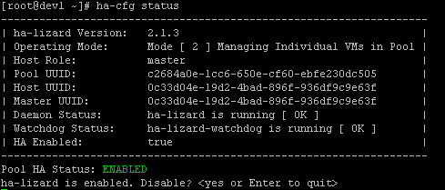

{width="4.033333333333333in"
height="2.5965277777777778in"}

**Installation and Reference Guide\
High Availability Virtualization\
using HA-Lizard\
with\
Citrix XenServer**

**Version 2.2.0 - FINAL\
December 2018**

The information in this document and any product or service
specifications referred to herein are subject to change without notice.

XenServer, XenCenter, Xen Cloud Platform and XCP are registered
trademarks or trademarks of Citrix System, Inc and Xen.org\
ILO and Integrated Lights Out are registered trademarks of the Hewlett
Packard Corporation.

No part of this document may be reproduced, copied, altered or
transmitted in any form or by any means, electronic, mechanical or
otherwise for any purpose whatsoever, without the express written
permission of the Copyright owner.

The information provided in this document is intended as a guide only
and is distributed in the hope that it will be useful, but WITHOUT ANY
WARRANTY; without even the implied warranty of MERCHANTABILITY or
FITNESS FOR A PARTICULAR PURPOSE. See the GNU General Public License for
more details.

No support is provided as part of the information in this document or
any related software. Contact the project sponsor, Pulse Supply
([www.pulsesupply.com](http://www.pulsesupply.com/)), for details on
support offerings.

**Copyright © 2018 Salvatore Costantino\
All rights reserved.**

All rights reserved. No part of this publication may be reproduced,
distributed, or transmitted in any form or by any means, including
photocopying, recording, or other electronic or mechanical methods,
without the prior written permission of the publisher, except in the
case of brief quotations embodied in critical reviews and certain other
noncommercial uses permitted by copyright law.

**IMPORTANT**

**\########################################################################**

**!!! HA-Lizard is free software: you can redistribute it and/or
modify**

**!!! it under the terms of the GNU General Public License as published
by**

**!!! the Free Software Foundation, either version 3 of the License,
or**

**!!! (at your option) any later version.**

**!!!**

**!!! HA-Lizard is distributed in the hope that it will be useful,**

**!!! but WITHOUT ANY WARRANTY; without even the implied warranty of**

**!!! MERCHANTABILITY or FITNESS FOR A PARTICULAR PURPOSE. See the**

**!!! GNU General Public License for more details.**

**!!!**

**!!! You should have received a copy of the GNU General Public
License**

**!!! along with HA-Lizard. If not, see
\<http://www.gnu.org/licenses/\>.**

**\#########################################################################**

Table of Contents

[1. HA-Lizard Version 2.2 8](#ha-lizard-version-2.2)

[• Purpose 8](#purpose)

[Version 1.6.40.4 - May 23, 2013 9](#version-1.6.40.4---may-23-2013)

[Version 1.6.41 - June 27, 2013 9](#version-1.6.41---june-27-2013)

[Version 1.6.41.4 - July 10, 2013 9](#version-1.6.41.4---july-10-2013)

[Version 1.6.42.3 - August 6, 2013 9](#version-1.6.42.3---august-6-2013)

[Version 1.7.2 - October 2013 10](#version-1.7.2---october-2013)

[Version 1.7.6 - December 2013 10](#version-1.7.6---december-2013)

[Version 1.7.7 - May 2014 10](#version-1.7.7---may-2014)

[Version 1.7.8 - July 2014 10](#version-1.7.8---july-2014)

[Version 1.8.5 - Feb 2015 11](#version-1.8.5---feb-2015)

[Version 1.8.7 - May 2015 11](#version-1.8.7---may-2015)

[Version 1.8.8 -- September 2015 11](#version-1.8.8-september-2015)

[Version 1.8.9 - June 2016 12](#version-1.8.9---june-2016)

[Version 1.9.1 - October 2016 12](#version-1.9.1---october-2016)

[Version 1.9.1.1 - November 2016 13](#version-1.9.1.1---november-2016)

[Version 2.0 - July 2016 13](#version-2.0---july-2016)

[Version 2.1.0 - November 2016 13](#version-2.1.0---november-2016)

[Version 2.1.1 - November 2016 14](#version-2.1.1---november-2016)

[Version 2.1.2 - November 2016 14](#version-2.1.2---november-2016)

[Version 2.1.3 - December 2016 15](#version-2.1.3---december-2016)

[Version 2.1.4 - August 2017 15](#version-2.1.4---august-2017)

[Version 2.2.0 - October 2018 16](#version-2.2.0---october-2018)

[2. Installation 17](#installation)

[• Installing 17](#installing)

[• Removing 17](#removing)

[3. Configuring 18](#configuring)

[• ha-cfg tool 18](#ha-cfg-tool)

[help 18](#help)

[show-alerts 19](#show-alerts)

[clear-alerts 19](#clear-alerts)

[ha-status 19](#ha-status)

[ha-enable 19](#ha-enable)

[ha-disable 19](#ha-disable)

[insert 19](#insert)

[remove 19](#remove)

[log 19](#log)

[get 19](#get)

[set 19](#set)

[get-vm-ha 20](#get-vm-ha)

[set-vm-ha 20](#set-vm-ha)

[Status 20](#status)

[Backup 21](#backup)

[Restore 21](#restore)

[restore-default 21](#restore-default)

[Email 21](#email)

[Email_debug 22](#email_debug)

[• Global Configuration 22](#global-configuration)

[• Override Configuration 23](#override-configuration)

[• Configuration Parameters 24](#configuration-parameters)

[HA Monitor Configuration 24](#ha-monitor-configuration)

[monitor_max_starts 24](#monitor_max_starts)

[monitor_killall 25](#monitor_killall)

[monitor_delay 25](#monitor_delay)

[monitor_scanrate 25](#monitor_scanrate)

[xc_field_name 25](#xc_field_name)

[op_mode 25](#op_mode)

[global_vm_ha 26](#global_vm_ha)

[enable_logging 26](#enable_logging)

[disabled_vapps 26](#disabled_vapps)

[xe_timeout 26](#xe_timeout)

[xapi_count 26](#xapi_count)

[xapi_delay 26](#xapi_delay)

[slave_ha 27](#slave_ha)

[promote_slave 27](#promote_slave)

[slave_vm_stat 27](#slave_vm_stat)

[mgt_link_loss_tolerance 27](#mgt_link_loss_tolerance)

[host_select_method 27](#host_select_method)

[Email Alert Settings 27](#email-alert-settings)

[Fencing Configuration Settings 28](#fencing-configuration-settings)

[Additional Local Configuration Parameters
30](#additional-local-configuration-parameters)

[4. Configuring Email Alerts 32](#configuring-email-alerts)

[• Configuring a Local SMTP Server 32](#configuring-a-local-smtp-server)

[• Configuring an SMTP Server with Authentication
32](#configuring-an-smtp-server-with-authentication)

[• Troubleshooting Email Alerting 33](#troubleshooting-email-alerting)

[5. Modes of Operation 35](#modes-of-operation)

[6. Managing HA Services 36](#managing-ha-services)

[• HA-Lizard System Service 36](#ha-lizard-system-service)

[Starting HA-Lizard 36](#starting-ha-lizard)

[HA Watchdog Service 36](#ha-watchdog-service)

[Disabling the Watchdog Service 36](#disabling-the-watchdog-service)

[• HA Monitor 37](#ha-monitor)

[• Managing HA for the Pool 37](#managing-ha-for-the-pool)

[Cluster Management and Fencing 38](#cluster-management-and-fencing)

[• Pool Cluster Management 38](#pool-cluster-management)

[Cluster Failover and Recovery Logic
38](#cluster-failover-and-recovery-logic)

[• Split Brain Handling 38](#split-brain-handling)

[• HA Suspension 39](#ha-suspension)

[Checking if a Host is Suspended 39](#checking-if-a-host-is-suspended)

[Restoring Suspended HA 40](#restoring-suspended-ha)

[• Fencing and STONITH 40](#fencing-and-stonith)

[ILO Fencing 40](#ilo-fencing)

[Pool Fencing 41](#pool-fencing)

[XVM Fencing 41](#xvm-fencing)

[iRMC Fencing 42](#irmc-fencing)

[Adding your own Custom Fencing Script
44](#adding-your-own-custom-fencing-script)

[7. Managing via XenCenter 45](#managing-via-xencenter)

[• Manage HA from XenCenter 46](#manage-ha-from-xencenter)

[• Viewing HA Status from XenCenter
48](#viewing-ha-status-from-xencenter)

[Application and Settings Examples
50](#application-and-settings-examples)

[• Auto-Start VMs -- Without Host High Availability
50](#auto-start-vms-without-host-high-availability)

[• Auto-Start VMs -- With Host High Availability
51](#auto-start-vms-with-host-high-availability)

[• 2-Node Pool -- With Host High Availability
52](#node-pool-with-host-high-availability)

[8. Miscellaneous 52](#miscellaneous)

[• Dependencies and Compatibility 52](#dependencies-and-compatibility)

[• Security and Ports 53](#security-and-ports)

[• Things to Know 53](#things-to-know)

[• Planned Future Improvements 53](#planned-future-improvements)

[• Support 54](#support)

# HA-Lizard Version 2.2

## Purpose

HA-lizard provides complete automation for managing Xen server pools
which utilize the XAPI management interface and toolstack (as in Xen
Cloud Platform and XenServer). The software suite provides complete HA
features within a given pool. The overall design is intended to be
lightweight with no compromise of system stability. Traditional cluster
management suites are not required. HA is provided with built in logic
for detecting and recovering failed services and hosts.

HA features provided:

-   Auto-start of any failed VMs

-   Auto-start of any VMs on host boot

-   Detection of failed hosts and automated recovery of any affected VMs

-   Detect and clean up orphaned resources after a failed host is
    removed

-   Removal of any failed hosts from pool with takeover of services

-   Fencing support for HP ILO, XVM and POOL fencing (forceful removal
    of host from pool)

-   Split brain prevention using heuristics from external network points
    and quorum

-   HA support for pools with two hosts

-   Structured interface for simple "bolt-on" of fencing scripts

-   Dual operating modes for applying HA to appliances or individual VMs

-   Ability to exclude selected appliances and VMs from HA logic

-   Auto detection of host status allows for safely working on hosts
    without disabling HA

-   Centralized configuration for entire pool stored in XAPI database

-   Command-line tool for managing global configuration parameters

-   Parameter override available per host for custom configurations

-   HA can be enabled/disabled via command line tool or graphical
    interface (like XenCenter)

-   Extensive Logging capabilities to system log file

-   Email alerting on configurable triggers

-   Dynamic cluster management logic auto-selects roles and determines
    recovery policy

-   No changes to existing pool configuration required. All logic is
    external.

-   **No dependencies** -- does not compromise pool stability or
    introduce complex SW packages. Designed to work with the resident
    packages on a standard XenServer host

Development is well tested and based on Xen Cloud Platform (XCP) version
1.6, XenServer 6.x-7.x, XCP-ng 7.x.

Release Notes

### Version 1.6.40.4 - May 23, 2013 {#version-1.6.40.4---may-23-2013 .unnumbered}

\- Minor cosmetic fixes

\- Corrected version number displayed when checking init script status

\- Updated some default setting values to more common values

\- Updated installation instructions

\- Fixed missing variable in XVM expect/tcl script

### Version 1.6.41 - June 27, 2013 {#version-1.6.41---june-27-2013 .unnumbered}

\- Improved host failure handling. No longer mandatory to \"forget
host\" in order to recover pool. New logic will disable a failed host in
the pool so that attempts to start VMs on a failed host will not be
made. Previously it was mandatory to forget a failed host from the pool
to ensure that no attempt was made to start a failed VM on a failed
host.

\- Improved installer better deals with upgrades and correctly resolves
relative path to itself.

### Version 1.6.41.4 - July 10, 2013 {#version-1.6.41.4---july-10-2013 .unnumbered}

\- Bug Resolved - two node pools failed to fence due to safety mechanism
which prevents fencing when a Master cannot reach any slaves.

### Version 1.6.42.3 - August 6, 2013 {#version-1.6.42.3---august-6-2013 .unnumbered}

\- Validated support for XenServer 6.2

\- Updated ha-cfg tool to warn user that a reset is required when
updating monitor timers

\- Updated ha-cfg tool to warn that FENCE_HOST_FORGET will be deprecated

\- Improved email alert handling prevents duplicate messages from being
sent for a configurable timeout - default 60 minutes

\- Updated email alert message notifying user of failed or started VM.
Message now includes the VM name-label AND UUID

\- Improved recovery from system crash which could erase configuration
cache if crash occurs while updating configuration

\- FD leak caused interrupted system calls which closed TCP sockets used
to check host status - Moved TCP socket connection from FD to alternate
method resolving issue with email alerts warning of failure to connect
to HTTP port of slaves.

### Version 1.7.2 - October 2013 {#version-1.7.2---october-2013 .unnumbered}

\- Replaced email alert logic to prevent hanging when network or DNS is
down

\- Suppress email alerts to avoid sending useless alerts while HA-Lizard
initializes

\- New python driven MTA replaces mailx from previous version. Mailx is
no longer required for alerts

\- Resolved issue when using OP_MODE=1 managing appliances, UUID array
was not properly read

### Version 1.7.6 - December 2013 {#version-1.7.6---december-2013 .unnumbered}

\- Resolved improperly handled exit status when fencing

\- Updated fencing logic. A slave must have quorum AND fence a master
before promoting itself to pool master

\- A slave that fails to fence a master and does not achieve quorum will
now self fence with a reboot. After reboot, slave\'s VMs will be off.

\- Master now only clears power states after successfully fencing slave.
Power states unaltered when fencing is disabled, no quorum or fails.

\- Clear potential dangling logger processes that could occur on unclean
exit or bad configuration parameters

\- Updated init script now manages logger processes

\- Added HA suspension for self fenced slaves which disables HA to
protect a potential split pool.

\- CLI tool now warns when HA is suspended due to a fencing event

\- Added email alert notification for HA suspend event

\- Added script for re-enabling HA when HA-Lizard is suspended - see
docs on events that can cause HA suspension

\- CLI tool improved to avoid creating orphaned processes while pool is
broken and called from a slave

### Version 1.7.7 - May 2014 {#version-1.7.7---may-2014 .unnumbered}

\- Optimized default settings for a 2-node pool configuration

### Version 1.7.8 - July 2014 {#version-1.7.8---july-2014 .unnumbered}

\- CLI arguments for \"set\" are no longer case sensitive - ie. \"ha-cfg
set mail_on 0\" OR \"ha-cfg set MAil_oN 0\" OR \"ha-cfg set MAIL_ON 0\"
are all valid

\- Added validation to check whether XenServer HA is enabled - will warn
via log and email alert and disable HA-Lizard if XenServer HA is
detected

### Version 1.8.5 - Feb 2015 {#version-1.8.5---feb-2015 .unnumbered}

\- Preliminary validation against XenServer 6.5 completed

\- updated CLI insert function to skip over parameters that already
exist in the DB to support completely automatic installation

\- updated installation script requires less user input

\- \--nostart argument now accepted by installer

\- updated CLI for compatibility with noSAN installer

\- Bug Fix - improperly handled command substitution fixed

\- Updated email handler eliminates dependency on sendmail

\- Email debug and test option added to CLI for troubleshooting email
settings

\- Additional email configuration parameters added to database and CLI
\<smtp_server, smtp_port, smtp_user, smtp_pass\>

### Version 1.8.7 - May 2015 {#version-1.8.7---may-2015 .unnumbered}

\- added Fujitsu iRMC fencing support

\- added tab completion for ha-cfg CLI. Dynamic context aware completion
resolves all possible valid inputs

\- display bug resolved which was displaying an error when get-vm-ha was
called and VMs HA state was set to NULL

\- bug fix - installer was not properly setting permissions on fence
methods

### Version 1.8.8 -- September 2015 {#version-1.8.8-september-2015 .unnumbered}

\- Improved pool state caching now updates state files while HA is
disabled (and service is still running). Resolves issues with pool
changes not being cached while HA is disabled or maintenance operations
underway

\- Reduced wait states while checking for failed hosts to respond.
Recovery time is now reduced \~ XAPI_COUNT X 10 seconds.

\- Fixed get-vm-ha results which were not properly displayed when VM
name label contained spaces

\- Improved behavior of configuration cache updates. Global settings are
now updated on all pool members regardless of whether HA is enabled. Old
behavior only updated global configuration params while HA was enabled.

### Version 1.8.9 - June 2016 {#version-1.8.9---june-2016 .unnumbered}

\- New logic introduced: when reboot_lone_host=1 in a 2-node pool,
master will self fence with a reboot upon loss of management network AND
slave not visible. Self fencing allows the slave to assert primary
storage role in the event that the storage link is active which would
lock the master\'s DRBD role as Primary. This logic helps in situations
where STONITH should really be used (and isn\'t) to shutdown the master.

\- Bug Fix - When op_mode=1 (HA for appliances), setting a description
for the appliance caused erroneous email alerts to be triggered.
Resolved.

### Version 1.9.1 - October 2016 {#version-1.9.1---october-2016 .unnumbered}

\- Improved logic for finding own hosts UUID. Previous logic depended on
the host name-label matching the hostname. This caused problems in cases
where users modified the system hostname. Updated logic is no longer
dependent on name-label and allows for freely modifying default system
hostname.

\- Added master management link state tracking to allow for clean
re-entry into a pool where the master has been fenced due to management
link being DOWN.

\- New logic prevents master from entering maintenance mode while
HA-Lizard is enabled

\- check_slave_status will now check manegement link state if failures
are detected

\- bugfix - slave was tracking whether it was in maintenance mode and
would re-enable itself upon detection causing reboots to abort.

\- bugfix - in certain conditions, HA could become disabled due to stale
DB entry after fencing a master. Condition is now checked on success of
promote_slave

\- Added shutdown of all VMs on a master that lost its management link

\- Improved speed of shutdown of master\'s VMs when the master has lost
its management link.

\- Improved status display from CLI now displays status of HA and
associated daemons.

\- bugfix - html body of email alerts were missing newline characters

\- Added pool status report to email alerts

\- Added validation of all VM ha-enabled state to ensure newly
introduced VMs have a valid state set

### Version 1.9.1.1 - November 2016 {#version-1.9.1.1---november-2016 .unnumbered}

\- bugfix - updated various functions to no longer depend on
name-label=hostname.

\################################################\
\## Begin XenServer Version 7+ support\
\## Prior 1.x releases for XenServer 6.X only\
\################################################

### Version 2.0 - July 2016 {#version-2.0---july-2016 .unnumbered}

\- Updated version for compatibility with XenServer 7 dom0

\- Improved error capturing and logging

\- New init logic compatible with systemd requirements to enable
operation on CentOS 7 style dom0

\- Updated CLI call to log

\- HA-Lizard init script updated to ALWAYS start watchdog on start.

### Version 2.1.0 - November 2016 {#version-2.1.0---november-2016 .unnumbered}

\- Improved logic for finding own hosts UUID. Previous logic depended on
the host name-label matching the hostname. This caused problems in cases
where users modified the system hostname. Updated logic is no longer
dependent on name-label and allows for freely modifying default system
hostname.

\- Added master management link state tracking to allow for clean
re-entry into a pool where the master has been fenced due to management
link being DOWN.

\- New logic prevents master from entering maintenance mode while
HA-Lizard is enabled

\- check_slave_status will now check management link state in case
failures are detected. Don\'t waste time checking slaves the master
cannot get to

\- bugfix - in certain conditions, HA could become disabled due to stale
DB entry after fencing a master. Condition is now checked on success of
promote_slave

\- Added shutdown of all VMs on a master that lost its management link

\- Added master management link tracking in support new logic which
evacuates VMs from a master that lost its management link

\- Improved speed of shutdown of master\'s VMs when the master has lost
its management link. Improvement will launch several parallel processes
to speed up the shutown of VMs

\- Added handling of XenServer bug XSO-586. In certain network
environments, xapi requires some delay before starting. Toolstack will
restart on first iteration/boot. (!! EXPERIMENTAL)

\- Improved status display from CLI now displays status of HA and
associated daemons.

\- bugfix - html body of email alerts were missing newline characters

\- Added pool status report to email alerts

\- Added validation of all VM ha-enabled state to ensure newly
introduced VMs have a valid state set

\- Added host health status tracking in support of improved host
selection logic when starting a VM. HOST_SELECT_METHOD configuration
parameter added for backward compatibility.

HOST_SELECT_METHOD=1 preserves old behavior. When a Master fences a
slave, connection to xencenter will be lost and API restarted

HOST_SELECT_METHOD=0 new logic. Tracks all host statuses and more
intelligently selects a host to start a VM on. XenCenter connectivity
not lost.

\- bugfix - updated various functions to no longer depend on
name-label=hostname.

### Version 2.1.1 - November 2016 {#version-2.1.1---november-2016 .unnumbered}

\- bugfix - Updated init which was not killing timed out calls to API
when connecting from a slave

\- added timeout handling to CLI to deal with situations where XAPI is
unresponsive

\- updated default installation parameters to support 2-node HA with no
configuration changes required

\- added pool VM running state validation to slaves to ensure local VMs
are not running elsewhere

\- reintroduction delay when master regains its MGT link is now
dynamically calculated based on xapi_delay and xapi_count params to
ensure a slave has enough time to recover

pool before reintroducing a former master that lost its management link.

\- bugfix - erroneous log stated VM started but there was no host to
start the VM on.

\- added CLI option \"restore-default\" to restore default
configurartion. Updated tab completion

### Version 2.1.2 - November 2016 {#version-2.1.2---november-2016 .unnumbered}

\- Improved VM recovery time by no longer waiting for a failed slave to
respond in certain situations.

\- Added variable timeout call handling to API to handle certain long
running functions

\- Improved resetting of powerstates that timed out in some cases where
slave was fenced but still showing as enabled in XAPI DB

\- bugfix- In rare cases, certain crash scenarios left hung VMs. Master
detects this and cleans up innapropriate states.

\- Added master role validations to capture rare cases that leave no
pool master

\- Added auto removal of slave suspended-HA mode. New logic no longer
requires manual intervention. Health status tracking is used to remove
the suspension automatically.

\- bugfix - in certain rare situations vm state validation failed due to
missing or corrupted stored local host UUID. Addl validations added.

\- Helpfile updates

### Version 2.1.3 - December 2016 {#version-2.1.3---december-2016 .unnumbered}

\- Added ha-status, ha-enable, ha-disable actions to CLI tool. Helpful
when calling ha-cfg from external scripts

\- Updated tab completion - added new cli command \'restore-default\'
and added restrictions on set-vm-ha/get-vm-ha to exclude snapshots

\- Added restriction to omit snapshots from list of pool VMs which could
cause erroneous alerts when taking snapshots.

\- Improved speed of cli command get-vm-ha

\- bugfix - status displayed control characters in 6.x deployments

\- unified codebase. Merged with 1.9.1

\- Updated init for backward compatibility with xenserver 6.x
environments

\- bugfix - deal with path to list_domains transparently irrespective of
dom0 release

\- added legacy xenops detection/support for xenserver 6.x environments

\- replaced host selection logic to be backward compatible

### Version 2.1.4 - August 2017 {#version-2.1.4---august-2017 .unnumbered}

\- Bug fix: updated init to wait for xapi to fully initialize before
starting ha-lizard

### Version 2.2.0 - October 2018 {#version-2.2.0---october-2018 .unnumbered}

\- Introduced a locking mechanism to detect when a VM has migrated to
another pool AND ha-lizard is running on the target pool. A token which
tracks the pool UUID the VM last ran on is now stored as a VM parameter
which blocks the target pool from auto-starting the VM. This is
important when using VM storage migration as the VM temporarily exists
on both pools at the same time while the migration is completing. This
addresses some cases where disk corruption could occur due to the same
VM being started on both pools at the same time.

\- Change in behavior for newly created VMs. When operating with default
settings (global_vm_ha=1), ha-lizard would immediately start any newly
created VM. This is no longer the case. Newly created VMs will remain in
the off state and only be treated with HA after the first manual start
of the VM which allows admins to complete their new VM creation tasks
without HA getting in the way with a forced start.

\- Updated peer network connectivity checks to be compatible with XCP-ng
7.6+

\- Add alerts generation. Will create a pool-level alert for all HA
actions and warnings which mirror email alerts. Feature can be toggled
on/off from CLI \"ha-cfg set enable_alerts 1\". Alerts can be viewed in
XenCenter or CLI

\- Updated VM backup logic to hide CIFS password in logs. See
/etc/ha-lizard/scripts/vm_backup.sh for details or
\"/etc/ha-lizard/scripts/vm_backup.sh \--help\"

\- Added new CLI options to display and clear HA-Lizard active alert
messages

\- Added hourly task to check disk SMART status and raise an alert on
any disk errors. All disks reported by the host are checked.

\- Added IP address input validation to CLI

\- Split user configuration parameters from initialization parameters
making it easier to introduce new parameters in future releases.

\- Improved debug includes main PID instead of subprocess PIDs in
output. This is helpful when reading debug as all relevant log lines can
now be referenced in a sequence more easily.

\- Tested for compatibility with XenServer 7.x and XCP-ng 7.5

(but should continue to be compatible with all versions from XCP 1.x
XenServer 6.x and 7.x, XCP-ng 7.x)

# Installation

As of version 2.2, HA-Lizard packaging has changed from a tarball with
an installation script to RPM. RPM packaging allows for simpler
installation and upgrades while providing a suitable package for
inclusion in a repository.

An installer is still included in the package, however, it is no longer
required and should be used only in special cases.

## Installing

-   Copy the RPM into a temporary location (ex. /tmp/)

-   Install the RPM\
    ***RPM -Uvh ha-lizard-2.2.\*.rpm***

The RPM installation will automatically install the default pool
parameter set in the XAPI database for initial installations and any new
parameters when upgrading.

Once the installation is completed, HA and watchdog services will not be
running (unless the installation is part of an upgrade) and the services
are not configured to start automatically on boot.

-   Activate the services\
    ***service ha-lizard start\
    service ha-lizard-watchdog start***

-   Start the services\
    ***service ha-lizard start\
    service ha-lizard-watchdog start***

Although these services are running at this point, HA is disabled for
the pool by default. HA can be enabled via the command line tool
\<ha-cfg\> once installation has been completed on all hosts within a
pool.

## Removing

-   Removal of HA-Lizard is handled through RPM.\
    ***rpm -e ha-lizard-2.2.\*.rpm***

# Configuring

## ha-cfg tool

A command line tool is provided with the package for managing
configuration and enabling/disabling HA for the entire pool. Usage is
displayed with "ha-cfg --help".

{width="7.489583333333333in" height="6.25in"}

### help {#help .unnumbered}

Display help for parameter settings

### show-alerts {#show-alerts .unnumbered}

Display any active alerts in the shell.

### clear-alerts {#clear-alerts .unnumbered}

Delete all HA-Lizard active alerts

### ha-status {#ha-status .unnumbered}

Displays HA status as true or false

### ha-enable {#ha-enable .unnumbered}

Enables pool HA

### ha-disable {#ha-disable .unnumbered}

Disables pool HA

### insert {#insert .unnumbered}

The default Centos based installer will run this tool with the "insert"
option. This action should only be completed one time for an entire
pool. Insert will create all the required global parameters and write
them to the XAPI database with default values. This tool is helpful when
installing on non-Centos based hosts where the default installer cannot
be used. Running this manually will initialize all default values.
Running this over an existing installation may overwrite the global pool
parameters.

### remove {#remove .unnumbered}

The "remove" option will erase all global parameters from the XAPI
database. This will essentially "clean" the database and should be
performed only when removing HA from a pool manually. The provided
uninstall script will execute this action by default.

### log {#log .unnumbered}

The "log" action will invoke a simple logging utility that displays
system logs written by HA. It is a convenient way to watch system
behavior and useful in troubleshooting.

### get {#get .unnumbered}

The "get" action lists all of the global parameters and their values.
This is useful for checking the current configuration and also for
retrieving the correct syntax of a parameter to be used in a "set"
command

### set {#set .unnumbered}

The "set" action is used modify the value of any global parameter. Set
requires additional command line arguments as follows:

"ha-cfg set \<parameter\> \<value\>"

Where \<parameter\> is the name of the parameter to be updated (correct
syntax of the parameter can be retrieved by invoking "ha-cfg get") and
\<value\> is the new value for the given parameter. Check the
configuration file documentation for a list of supported values.

### get-vm-ha {#get-vm-ha .unnumbered}

The "get-vm-ha" action will list all VMs within a pool and display
whether HA is enabled for each VM. Additional information is provided
depending on the pool setting context. This tool is useful for quickly
determining the HA status of any VM.

{width="6.208333333333333in"
height="1.3229166666666667in"}

### set-vm-ha {#set-vm-ha .unnumbered}

The "set-vm-ha" action is used to enable or disable HA for the specified
VM name-label. The passed in name-label must exactly match the name of
the VM. Value must be set to true or false.

{width="6.497916666666667in"
height="0.8388888888888889in"}

***Important: If the vm name-label has spaces, it must be wrapped in
single or double quotes as follows:\
ha-cfg set-vm-ha "VM name with spaces" true***

### Status {#status .unnumbered}

The "status" action displays whether HA is enabled or disabled for the
pool and allows for the toggling of the status. This should be used to
enable/disable HA for the pool as shown below.

{width="5.09375in" height="2.1770833333333335in"}

### Backup {#backup .unnumbered}

Usage \<ha-cfg restore /path/to/file/filename\>

The backup command will create a backup file of the pool configuration
settings for ha-lizard. A filename must be specified to declare the
filename and path for the backup.

### Restore {#restore .unnumbered}

Usage \<ha-cfg restore /path/to/file/filename\>

The restore command will restore a previously backed up configuration
file. A filename must be specified. The restore command need only be run
on a single host in the pool (any host regardless of master/slave
status) Settings are restored and applied to all hosts within the pool.
When restoring new values for the monitor timers and monitor triggers, a
restart of the ha-lizard service is necessary for a host to read in the
new settings. The service is automatically restarted on the host where
the restore command is called. It is advised that the service be
restarted manually on any other hosts within the pool with "service
ha-lizard restart".

### restore-default {#restore-default .unnumbered}

Usage \<ha-cfg restore-default\> Restores default installation settings

### Email {#email .unnumbered}

Usage \<ha-cfg email\>

The email command will sent a test email alert using the configured
email settings. This is useful to for testing the configured values to
ensure that email alerting is working properly. Sample output is
displayed below.

{width="6.502777777777778in"
height="1.0555555555555556in"}

### Email_debug {#email_debug .unnumbered}

Usage \<ha-cfg email_debug\>

The email_debug command is identical to the email command except that it
will produce verbose SMTP log and output it to stdout. This is useful
when troubleshooting SMTP problems.

## Global Configuration

Global configuration parameters are stored in the XAPI database shared
by all hosts within a pool. A command-line tool, "ha-cfg", is provided
for making changes to any of the global parameters. To view the current
configuration, use "ha-cfg get". Sample output is shown below.

{width="4.260416666666667in"
height="6.052083333333333in"}

Any global configuration parameter can be updated using the "ha-cfg set"
command. For example, to disable logging globally, use "ha-cfg set
enable_logging 0"

## Override Configuration

By default, configuration settings for the entire pool are centrally
stored and managed. A single set of configuration parameters is used
across all hosts within a pool, regardless of whether a host is acting
as the pool master or a slave. This makes management simple while
eliminating the need to manage individual configuration files on each
host within a pool.

In cases where a custom configuration is required for individual hosts
within a pool, the system will allow for the override of any global
settings. All override settings are stored in
/etc/ha-lizard/ha-lizard.conf. By default, all settings are commented
out of this file. Uncommenting a setting will override the global
setting for a particular host on the next invocation of the HA logic
loop.

This is useful in cases where custom settings are required for a host
that should not be shared with other hosts in the pool. One example of a
good use is the SLAVE_VM_STAT setting which determines whether Slaves
within the pool will try to start any VMs that are not running. By
default this is disabled and only the Master is configured to start VMs
that should be running. The default settings work fine for a small pool,
but, in very large pools it may take some time for the Master to loop
through all VMs and check their status. Enabling SLAVE_VM_STAT on a few,
but not all, Slaves will speed up the process of detecting VM failures
and restoring services. In this case, the override settings can be used
to enable this on only selected hosts.

## Configuration Parameters

### HA Monitor Configuration {#ha-monitor-configuration .unnumbered}

The HA service is run by a monitoring service which runs continuously.
The following Monitor settings are used to configure the behavior of the
monitor. The provided installer installs and configures the Monitor with
default settings that are acceptable in most cases. Once installed, the
Monitor will run continuously as a service. Status can be checked with
"service ha-lizard status". As of version 1.7.7 the default parameter
installed will be optimized for a 2-node pool with fast detection and
switching of roles (failure detection in \< 15 seconds).

Some values may need to be changed depending on the environment. Host
performance (how long it takes to iterate through HA processes launched
by the Monitor) and the size of the pool should be considered when
setting these parameters.

The Monitor will launch several HA processes in a loop every 15 seconds
(MONITOR_DELAY). The default setting of 15 seconds is intended for
compact pools of 2-nodes. This value should be increased for larger
pools. Generally 45 seconds is adequate for pools of 3-8 hosts. It is a
good idea to watch the system logs to ensure that all the HA processes
have finished running within the MONITOR_DELAY window. By increasing
MONITOR_DELAY, it will take longer to detect a failure. Decreasing
MONITOR_DELAY will more quickly detect failures and recover. System
performance and preferences should be considered carefully.

### monitor_max_starts {#monitor_max_starts .unnumbered}

Threshold for when o assume running processes are not responding. Sets
how many failed starts to wait before killing any hung processes. Use
caution with this setting. It should be set relatively high as a pool
recovery procedure will take considerably more time to execute causing
the system to trigger logic which attempts to detect hung processes.
Processes will generally never hang unless XAPI becomes totally
unresponsive. Logic is provided to abort attempts to connect to XAPI
during a failure. In this case, local state files with pool state
information from the last successful iteration will be used instead.
Default = 20

### monitor_killall {#monitor_killall .unnumbered}

If MAX_MONITOR_STARTS threshold is reached - set whether to kill all
ha-lizard processes. Default = 1\
1 = yes, 0 = no

### monitor_delay {#monitor_delay .unnumbered}

Delay in seconds between re-spawning ha-lizard. This should be adjusted
to the environment. Large pools require more time for each run of
ha-lizard. Default = 15

### monitor_scanrate {#monitor_scanrate .unnumbered}

ha-lizard will not re-spawn unless all current processes are completed.
If there are active processes while attempting to start a new iteration,
ha-lizard will wait the number of seconds set here before retrying. Each
successive fail will increment a counter (MONITOR_MAX_STARTS) that may
trigger KILLALL. Default = 10

### xc_field_name {#xc_field_name .unnumbered}

Field name used to enable / disable HA for pool. This can also be set
within XenCenter management console to enable/disable HA within the
pool. To make this field visible within XenCenter, create a custom pool
level field with the name set here. The configuration contents will then
be visible and alterable within XenCenter. See section on configuring
XenCenter for more details.

### op_mode {#op_mode .unnumbered}

Set the operating mode for ha-lizard. 1 = manage appliances, 2 = manage
virtual machines

Default value = 2

Mode 1 uses logic to manage appliances within the pool. By default, all
appliances within a pool are managed by HA without requiring any
additional settings. This is useful for small pools where most HA
management functions can be handled from within XenCenter. Simply add
VMs to appliances and those VMs are automatically managed. Any VM that
is not part of an appliance is not managed by HA. This technique greatly
simplifies HA management as each individual VM does not require any
special settings. If some appliances should not be managed by HA, simply
add the UUID of the appliances to be skipped in the DISABLED_VAPPS
setting.

Managing appliances also provides a convenient way to configure startup
order and delays when recovering VMs. This can be done as part of the
standard appliance configuration settings.

Mode 2 provides greater flexibility by providing a mechanism for more
granular control over which pool VMs are managed. Appliances are not
managed in this mode. By default (when GLOBAL_VM_HA is set to 1), all
VMs are automatically managed by HA. If GLOBAL_VM_HA is set to 0, then
each VM within the pool must have HA explicitly enabled or disabled.
This can be set from the pool GUI with access to custom configuration
parameters or via the command line tool ha-cfg.

### global_vm_ha {#global_vm_ha .unnumbered}

Set whether to individually enable HA on each VM within the pool (when
OP_MODE = 2)\
0 = You must individually set ha-lizard-enabled to true/false for each
VM within the pool\
1 = ALL VMs have HA enabled regardless of setting in GUI/CLI

Default value = 1

### enable_logging {#enable_logging .unnumbered}

Enable Logging 1=yes, 0=no. Logs are written to /var/log/messages or
/var/log/user.log (depending on dom0 distribution). All log messages are
labeled with \"ha-lizard\" for easy filtering. View/Filter real time
logging with: "tail -f /var/log/\[messages\|user.log\] \| grep
ha-lizard"

### disabled_vapps {#disabled_vapps .unnumbered}

Specify UUID(s) of vapps that do not get automatically started by
ha-lizard when OP_MODE=1 (manage appliances) Array is \":\" delimited
like this (UUID1:UUID2:UUID3) Leave blank if ALL vapps are managed by
ha-lizard \"DISABLED_VAPPS=()\" Only applied when OP_MODE=1

### xe_timeout {#xe_timeout .unnumbered}

Set the maximum wait time for calls to the xe toolstack to respond. If
xe does not respond within XE_TIMEOUT seconds, the xe PID will be
killed. This is done to prevent xe calls from hanging in the event of a
Master host failure. In the event of a Master failure, xe may hang on
requests from pool slaves. This timeout will ensure that fencing the of
master host is not prevented. Default setting is 5 seconds which is
ample time for a well running pool. Poor performing hosts may need to
set this value higher to prevent unintended process terminations during
normal operation.

### xapi_count {#xapi_count .unnumbered}

If a pool member cannot reach a pool peer, XAPI_COUNT is the number of
retry attempts when a host failure is detected. If the unresponsive host
is recovered before the XAPI_COUNT is reached, attempts to fence and
remove the failed host will be ignored.

Default XAPI_COUNT = 2

### xapi_delay {#xapi_delay .unnumbered}

If a pool member cannot reach a pool peer, XAPI_DELAY is the number of
seconds to wait in between XAPI_COUNT attempts to contact the
unresponsive host.

DEFAULT XAPI_DELAY = 10 seconds

### slave_ha {#slave_ha .unnumbered}

If the Pool Master cannot be reached and all attempts to reach it have
been exhausted, set whether the autoselected slave will try to start
appliances and/or VMs. (PROMOTE_SLAVE must also be set to 1 for this to
work)

### promote_slave {#promote_slave .unnumbered}

If the pool master cannot be reached - set whether slave should be
promoted to pool master (this only affects a single slave: the
\"autoselect\" winner chosen by the former master to recover the pool).
More on this topic is available in the Cluster Management section.

### slave_vm_stat {#slave_vm_stat .unnumbered}

By default, only the pool master will check the status of all VMs
managed by this script and attempt to start a VM that is not in the
running state. Setting SLAVE_VM_STAT to 1 will cause any pool slaves to
also check all VM statuses and attempt to start any VM not in the
running state. Default = 0 In a large pool many hosts may attempt to
start the same VM the first host to attempt will succeed, others will be
safely declined. Enabling may create many unnecessary duplicate
processes in the pool.

### mgt_link_loss_tolerance {#mgt_link_loss_tolerance .unnumbered}

Set the maximum number of seconds that the pool master can lose its
management link. The timer is triggered by the management interface
being down (as in a cable pull or switch power failure). Once the
timeout has been reached, the master will forcefully shutdown any VMs
running on the master. Default value = 5 seconds. This timer should be
kept short to ensure that a surviving slave can exclusively start any
affected VMs.

### host_select_method {#host_select_method .unnumbered}

Select the method used to select a host to start a VM on.\
0 = intelligent mode. A host is selected based on its health which is
tracked every few seconds.\
1 = legacy mode. A slave failure will also trigger a loss of XenCenter
connectivity\
Default value = 0 (recommended setting is 0)

### Email Alert Settings {#email-alert-settings .unnumbered}

-   mail_on: Enable/Disable email alerts. 1 = enabled 0 = disabled

-   mail_subject: Subject Line of email alert

-   mail_from: The FROM email address used on email alerts

-   mail_to: the email address to send alerts to

-   smtp_server: Declare the SMTP server to use for sending email alerts

-   smtp_port: Declare the port number for the SMTP server

-   smtp_user: If the SMTP server requires login, set the username

-   smtp_pass: If the SMTP server requires login with a password, set
    the password

Important: Do not use spaces when setting via the CLI tool. If spaces
are required in the subject line, use the override configuration file
instead and wrap the string in double quotes like this. "Mail Subject"

### Fencing Configuration Settings {#fencing-configuration-settings .unnumbered}

Currently Supported FENCE_METHOD = ILO, XVM, POOL, IRMC

ILO is the HP Integrated Light Out management interface

XVM is intended for test environments with nested xen instances where
pool domos are domus within a single xen host.

POOL does not fence failed hosts. It simply allows the forceful removal
of a failed host from a pool.

IRMC is a Fujitsu BMC similar to HP ILO

The name of any custom fencing agent can also be named here. See the
fencing section for details on using a custom fencing script.

#### FENCE_ENABLED

Enable/Disable Fencing 1=enabled 0=disabled

#### FENCE_FILE_LOC

Location to store and look for fencing scripts

#### FENCE_HA_ONFAIL

Select whether to attempt starting of failed host's VMs on another host
if fencing fails 1=enabled 0=disabled

#### FENCE_METHOD

ILO, XVM and POOL supported. \"FENCE_METHOD=ILO\" - custom fencing
scripts can be added and called here

#### FENCE_PASSWD

Password for fence device (only if required by the fence device)

#### FENCE_ACTION

Supported actions = start, stop, reset

#### FENCE_REBOOT_LONE_HOST

If Master host cannot see any other pool members (in pools with 3 or
more hosts), choose whether to reboot before attempting to fence peers.
This may not matter if quorum is used (see FENCE_QUORUM_REQUIRED)
1=enabled 0=disabled

In version 1.8.9 the logic has been expanded to deal with a 2-node pool.
In a 2-node pool, the master will self fence (in the form of a reboot).
This releases the primary storage role from being asserted for users
running iSCSI-HA in conjunction with HA-Lizard. In doing so, a surviving
slave (which promotes itself to pool master) would be able to assert the
primary storage role which is required to expose disk images to VMs.

#### FENCE_IPADDRESS

Only used for static fencing device - currently XVM host supported. Can
be used for custom fencing scripts that call a static IP such as a power
strip.

#### FENCE_HOST_FORGET

**Will be Deprecated in future release -- only use if you know what you
are doing. As of version 1.6.41 -- this is no longer necessary. Setting
this to 0 is recommended.**\
Select whether to forget a fenced host (permanently remove from pool)
1=enabled 0=disabled.

#### FENCE_MIN_HOSTS

Do not allow fencing when fewer than this number of hosts are remaining
in the pool. Default value = 2 which is optimized for a 2-node pool.

#### FENCE_QUORUM_REQUIRED

Select whether pool remaining hosts should have quorum before allowing
fencing. 1=enabled 0=disabled

#### FENCE_USE_IP_HEURISTICS

Select whether to poll additional IP endpoints (other than the pool
hosts) and possibly create an additional vote used to determine quorum
for the pool. This can be helpful in a 2 node pool where quorum cannot
otherwise be achieved. 1=enabled 0=disabled

#### FENCE_HEURISTICS_IPS

Create a list of IP addresses or domain names to check. The list should
be delimited by ":"

As of version 1.7.7 the default value is set to 8.8.8.8 which is a
well-known address. ***However, live production systems should NOT use
the default address.*** This address should ideally be set to a local IP
on the management network which is very close to the management
interface of the hosts. Typically this would be the IP address of the
switch the hosts are connected to. If more than one IP address is
specified then all of the addresses must be successfully reached with
ping in order to count as a single vote.

### Additional Local Configuration Parameters {#additional-local-configuration-parameters .unnumbered}

Granular control over logging and email alerts is provided in the local
configuration override file. These settings allow for enabling/disabling
logging alerts and email alerts on a per function basis. These can be
useful when troubleshooting / logging a specific function or to minimize
the volume of log files and system email alerts.

Below enables / disables logging per function 1=enable 0=disable

LOG_check_ha_enabled=1 enable / disable logging for check_ha_enabled\
LOG_get_pool_host_list=1 enable / disable logging for
get_pool_host_list\
LOG_get_pool_ip_list=1 enable / disable logging for get_pool_ip_list\
LOG_master_ip=1 enable / disable logging for master_ip\
LOG_check_xapi=1 enable / disable logging for check_xapi\
LOG_get_app_vms=1 enable / disable logging for get_app_vms\
LOG_vm_state=1 enable / disable logging for vm_state\
LOG_vm_state_check=1 enable / disable logging for vm_state_check\
LOG_vm_mon=1 enable / disable logging for vm_mon\
LOG_promote_slave=1 enable / disable logging for promote_slave\
LOG_get_vms_on_host=1 enable / disable logging for get_vms_on_host\
LOG_get_vms_on_host_local=1 enable / disable logging for
get_vms_on_host_local\
LOG_check_vm_managed=1 enable / disable logging for check_vm_managed\
LOG_write_pool_state=0 enable / disable logging for write_pool_state
***Produces allot of logging - off by default***\
LOG_check_slave_status=1 enable / disable logging for
check_slave_status\
LOG_fence_host=1 enable / disable logging for fence_host\
LOG_email=1 enable / disable logging for email\
LOG_autoselect_slave=1 enable / disable logging for autoselect_slave\
LOG_check_quorum=1 enable / disable logging for check_quorum\
LOG_xe_wrapper=1 enable / disable logging for xe_wrapper\
LOG_check_logger_processes=1 enable / disable logging for
check_logger_processes\
LOG_check_xs_ha=1\
LOG_disable_ha_lizard=1\
LOG_update_global_conf_params=1\
LOG_service_execute=1\
LOG_stop_vms_on_host=1\
LOG_check_master_mgt_link_state=1\
LOC_write_status_report=1\
LOG_validate_vm_ha_state=1\
LOG_reset_vm_vdi=1\
LOG_validate_this_host_vm_states=1

Below enables / disables email alerts per function 1=enable 0=disable

MAIL_get_pool_host_list=1 enable / disable email alerts for
get_pool_host_list\
MAIL_get_pool_ip_list=1 enable / disable email alerts for
get_pool_ip_list\
MAIL_master_ip=1 enable / disable email alerts for master_ip\
MAIL_check_xapi=1 enable / disable email alerts for check_xapi\
MAIL_get_app_vms=1 enable / disable email alerts for get_app_vms\
MAIL_vm_state=1 enable / disable email alerts for vm_state\
MAIL_vm_state_check=1 enable / disable email alerts for vm_state_check\
MAIL_vm_mon=1 enable / disable email alerts for vm_mon\
MAIL_promote_slave=1 enable / disable email alerts for promote_slave\
MAIL_get_vms_on_host=1 enable / disable email alerts for
get_vms_on_host\
MAIL_get_vms_on_host_local=1 enable / disable email alerts for
get_vms_on_host_local\
MAIL_check_vm_managed=1 enable / disable email alerts for
check_vm_managed\
MAIL_write_pool_state=1 enable / disable email alerts for
write_pool_state\
MAIL_check_slave_status=1 enable / disable email alerts for
check_slave_status\
MAIL_fence_host=1 enable / disable email alerts for fence_host\
MAIL_email=1 enable / disable email alerts for email\
MAIL_autoselect_slave=1 enable / disable email alerts for
autoselect_slave\
MAIL_check_quorum=1 enable / disable email alerts for check_quorum\
MAIL_xe_wrapper=1 enable / disable email alerts for xe_wrapper\
MAIL_check_xs_ha=1\
MAIL_update_global_conf_params=1\
MAIL_service_execute=1\
MAIL_stop_vms_on_host=1\
MAIL_check_master_mgt_link_state=1\
MAIL_write_status_report=1\
MAIL_validate_vm_ha_state=1\
MAIL_reset_vm_vdi=1\
MAIL_validate_this_host_vm_states=1

# Configuring Email Alerts

HA-Lizard can be configured to send email alerts for a variety of events
that an administrator should generally be aware of. As of version 1.8,
the method for configuring email has changed. Prior to version 1.8.x,
HA-Lizard relied on sendmail running locally to act as an SMTP relay for
sending messages. The need to install and run sendmail locally has been
removed in version 1.8.x in an effort to remove ALL dependencies from
HA-Lizard.

Version 1.8.x will continue to be backward compatible with earlier
versions and can use a local SMTP relay (sendmail) if configured to do
so.

## Configuring a Local SMTP Server

Email alerts require that an SMTP server is specified for sending email.
The default setting for the SMTP server on a new installation is
"127.0.0.1". For users running sendmail locally, this will automatically
route all messages through sendmail. The following settings will work
with a locally running SMTP relay that does not require user login:

MAIL_FROM=\<your from email address\>\
MAIL_ON=1\
MAIL_SUBJECT=\"SYSTEM_ALERT-FROM_HOST:\$HOSTNAME\"\
MAIL_TO=\<your to email address\>\
SMTP_PASS=\
SMTP_PORT=\"25\"\
SMTP_SERVER="127.0.0.1"\
SMTP_USER=

## Configuring an SMTP Server with Authentication

The preferred method of configuring email alerts is to use an outside
SMTP server rather than run an SMTP relay on the control domain. The
configuration settings will support any standard SMTP server with or
without login. The following settings will work with a remote SMTP
server. ***Adapt to match your environment. These settings are a sample
only.***

MAIL_FROM=\<your from email address\>\
MAIL_ON=1\
MAIL_SUBJECT=\"SYSTEM_ALERT-FROM_HOST:\$HOSTNAME\"\
MAIL_TO=\<your to email address\>\
SMTP_PASS=smtp_password\
SMTP_PORT=\"25\"\
SMTP_SERVER=smtp.your_smtp_domain_here.com\
SMTP_USER=smtp_username

## Troubleshooting Email Alerting

The HA-Lizard CLI provides tools for testing and validating email
settings. Once the desired configuration settings have been applied, a
test email can be sent from the CLI as follows:

ha-cfg email

{width="6.500694444444444in"
height="0.9972222222222222in"}

If the email and SMTP server settings are correct configured, an email
alert should be received by the user set in the mail_to field.

Alternatively, the CLI can be used to send a test email while producing
verbose debug. This can be very useful to troubleshoot the interaction
between the host and the SMTP server. A test email with debug can be
sent using the CLI as follows:

ha-cfg email_debug

An error message such as the one below may be seen when a socket
connection could not be made to the configured SMTP server

{width="6.502083333333333in"
height="2.167361111111111in"}

A successful email alert will produce debug similar to the below
example:

{width="6.501388888888889in"
height="6.896527777777778in"}

# Modes of Operation

Two modes of operation are supported by HA-Lizard.

Mode 1 uses logic to manage appliances within the pool. By default, all
appliances within a pool are managed by HA without requiring any
additional settings. This is useful for small pools where most HA
management functions can be handled from within a compatible graphical
configuration utility. Simply add VMs to appliances and those VMs are
automatically managed. Any VM that is not part of an appliance is not
managed by HA. This technique greatly simplifies HA management as each
individual VM does not require any special settings. If some appliances
should not be managed by HA, simply add the UUID of the appliances to be
skipped in the DISABLED_VAPPS setting.

Mode 2 provides greater flexibility by providing a mechanism for more
granular control over which pool VMs are managed. Appliances are not
managed in this mode. By default (when GLOBAL_VM_HA is set to 1), all
VMs are automatically managed by HA. If GLOBAL_VM_HA is set to 0, then
each VM within the pool must have HA explicitly enabled or disabled.
This can be set from the pool GUI with access to custom configuration
parameters or via the command line tool ha-cfg.

The operating mode can be configured as a global setting or override
setting which allows hosts within a pool to operate in a mixed
environment with some hosts managing VMs while others manage appliances.
Usually the default global setting which manages VMs is adequate.

The default global settings manage all VMs within a pool and attempts to
move VMs from failed hosts or start them if not running. This approach
works well in most instances. If more granularity is required to select
only certain VMs as managed and others ignored, a configuration setting
is provided which can be set per VM. Settings can be applied using the
ha-cfg command line tool or via a compatible graphical management
interface with visibility into custom XAPI fields.

# Managing HA Services

## HA-Lizard System Service

When installing on a CentOS based Dom0, the installer will install a
startup script in /etc/init.d and set it to automatically start each
time the server is started. Generally there are no additional steps
required in setting up the system service.

The service can be checked, stopped or invoked with the "*service*"
command which manages System V init scripts. The following arguments are
supported:

"service ha-lizard start": starts the service\
"service ha-lizard stop": stops the service\
"service ha-lizard status": reports running status of the service

By default a watchdog service is installed and started with when
installing with the included installer.\
Important Note: Stopping the HA service while the watchdog service is
running will be ineffective as the watchdog will restart the HA service
within a few seconds after a stop. In previous versions of HA-Lizard,
The HA-Lizard init script can be invoked with a "-w" option to also
start or stop the watchdog service with the HA service. The --w option
has been removed as of version 2.1 due to the inability to pass
additional arguments under system/

### Starting HA-Lizard {#starting-ha-lizard .unnumbered}

"service ha-lizard start": starts the service *[AND]{.underline}*
watchdog\
"service ha-lizard stop": stops the service (watchdog will continue to
run)\
"service ha-lizard status": reports running status of the service

### HA Watchdog Service {#ha-watchdog-service .unnumbered}

A watchdog service is installed by default and started/stopped via the
main service init sctipt or can be individually managed with:

"service ha-lizard-watchdog start": starts the service\
"service ha-lizard-watchdog stop": stops the service\
"service ha-lizard-watchdog status": reports running status of the
service

The default watchdog interval for checking the HA service is 10 seconds.
This can be changed by editing the variable "WATCH_INTERVAL" in
/etc/init.d/ha-lizard-watchdog.

### Disabling the Watchdog Service {#disabling-the-watchdog-service .unnumbered}

The watchdog service is mandatory when fencing is enabled. If fencing is
not enabled, the watchdog service can be disabled by commenting or
deleting the line "WATCHDOG=/etc/init.d/ha-lizard-watchdog" in the HA
init script located in /etc/init.d/ha-lizard.

## HA Monitor

A *monitor daemon* is provided for manually running the HA service. This
is intended only for systems that are not compatible with the provided
init script as described above.

*Avoid running this script if the system service is already installed as
it could result in multiple monitors running that will impact
performance.*

The monitor is required to be running at all times for HA to work. It
can be started in any of the following manners:

-   Manually start the monitor and background it:\
    /etc/ha-lizard/scripts/ha-lizard.mon &

-   If your host runs a Dom0 operating system other than the default
    CentOS, an init script can be created that calls
    /etc/ha-lizard/scripts/ha-lizard.mon

-   Add a line to /etc/rc.local which calls the monitor script on boot.\
    /etc/ha-lizard/scripts/ha-lizard.mon &

## Managing HA for the Pool

In order for the pool to operate in HA mode, each host in the pool must
be running the monitor service as described above. The monitor will
periodically call the main HA-Lizard logic which executes the HA logic
for the pool. A number of configurable timers and triggers can be found
in the configuration settings which determine how often the monitor will
invoke the HA script and when to abort. Regardless of the method chosen
to run the monitor, the pool must have HA enabled to operate in HA mode.

*Enabling HA is different than starting the monitor.*

Three methods are provided for enabling and disabling HA for the pool:

-   Enable / Disable HA via XenCenter or any compatible GUI capable of
    modifying a custom configuration field

-   Use the CLI tool: "ha-cfg status"

-   Use theh CLI too: "ha-cfg ha-enable"

Regardless of the state of HA for the pool, the monitor service will
continue to run in the background on each host within the pool. The
monitor will detect whether HA is enabled periodically and decide
whether to provide pool level HA depending on operating status for the
pool.

# Cluster Management and Fencing {#cluster-management-and-fencing .unnumbered}

Cluster management and fencing with STONITH are provided with the
HA-Lizard package. The behavior is configured via the global
configuration settings or override settings.

## Pool Cluster Management

The system does not require the use of any outside cluster manager which
would add more complexity to a host/pool. The overall software design
tries to avoid the addition of any packages/services which would
introduce complexity and potential instability into the system. Given
this, built in cluster management is provided and designed to be
lightweight and fairly extensible.

### Cluster Failover and Recovery Logic {#cluster-failover-and-recovery-logic .unnumbered}

Node failover and recovery logic is designed around the pool concept of
"Master and Slaves". A pool can have only a single Master node and any
number of Slaves. Given this, cluster management is provided in this
fashion.

-   Slaves cannot detect other slave failures or remove other slaves
    from the pool

-   Only the Master host can detect a Slave Host failure and take steps
    to fence and remove the Slave from the pool

-   Only a single Slave is allowed to detect a Master host failure. In
    this case the Slave can eject the former Master host and promote
    itself to the new pool Master. This is done intentionally to avoid a
    race condition where multiple Slaves try to become the Pool Master.

-   The single Slave which is allowed to eject a failed Master and
    become the new Pool Master is dynamically chosen by the Pool Master
    on each invocation of HA (approximately every minute). The chosen
    Slave ("autopromote winner") will have its UUID stored in the XAPI
    database. Slaves will then determine their status in the pool by
    checking this value on every invocation of HA. In the event of a
    Master failure, XAPI may be unresponsive, in this case Slaves will
    use the "autopromote winner" identity stored in local state files
    from the last successful iteration.

-   All logic is completely dynamic and requires no static settings to
    determine what roles hosts play in the cluster. Each iteration of HA
    will detect whether a host is the Pool Master or Slave and then
    execute logic which specifically applies to the hosts role. Each
    iteration also selects a new "autopromote winner". In the event of a
    Master failure and takeover by a Slave (autopromote winner), the new
    Master will then automatically select a new Slave as being eligible
    to take over as Master.

## Split Brain Handling

IP Heuristics can be used as an additional quorum vote when checking
whether the remaining hosts in a pool have quorum to take over services
and remove failed hosts. This can be especially useful in the case of a
2 node pool, where quorum would be impossible to achieve, thus
preventing any HA recovery measures from being executed. Although there
is no limit to the number of IP addresses that can be used, one should
carefully consider the selection of useful addresses, keeping in mind
that a large number of addresses will slow down any recovery procedures.
Some good addresses to check would be the IP address of a shared storage
pool and the IP address of a network switch which is common or shared by
all the hosts in a pool. Regardless of the number of IP addresses that
are checked, all of the IP addresses must by successfully reached with
ICMP ping to count as a single vote. In a two node pool, this additional
vote would give the surviving node enough votes to take over the
services of the failed node.

## HA Suspension

To further prevent the possibility of a split brain scenario, slaves
that fail to fence a master or lack quorum for the pool will enter into
a suspended HA mode and reboot once. After the reboot, the host's HA
logic will be suspended until either:

\- an administrator resolves the pool failure and manually removes the
suspension by running the following script:
/etc/ha-lizard/scripts/recover_fenced_host.

\- the affected host automatically removes the suspension when its
health status returns to "healthy"

After the initial reboot, the host will remain in the suspended state
and is blocked from employing any HA logic including:

-   Fencing a master

-   Starting VMs

HA suspension only affects the host that has self fenced. The remaining
members of the pool are unaffected.

### Checking if a Host is Suspended {#checking-if-a-host-is-suspended .unnumbered}

The system will send an email alert when a host enters into suspended HA
mode. By default, an alert will be triggered every hour until the system
administrator has resolved the issue and cleared the suspension. The CLI
tool can be used to check whether a host is suspended by checking status
with "ha-cfg status".

A host in suspended mode will display a notice as shown below:

{width="6.498611111111111in"
height="1.7979166666666666in"}

### Restoring Suspended HA {#restoring-suspended-ha .unnumbered}

A suspended host should only be restored after the pool has been fully
restored to a normal operating state. Suspension is removed by executing
/etc/ha-lizard/scripts/recover_fenced_host from the local command shell
of the affected host. A warning is displayed -- simply pressing
\<enter\> will remove the suspension.

{width="6.502777777777778in"
height="1.3506944444444444in"}

## Fencing and STONITH

Currently, three fencing options are supported; POOL, ILO and XVM.
Additionally, a structured interface is provided so that custom fencing
scripts can be easily implemented.

### ILO Fencing {#ilo-fencing .unnumbered}

ILO fencing is included as part of HA and developed and tested on ILO 2.
The fencing logic will power off a host and return exit status verifying
that the power state is off before forcefully removing a host from the
pool configuration.

The following configuration parameters provide basic ILO fencing:

FENCE_ENABLED=1\
FENCE_ACTION=stop\
FENCE_FILE_LOC=/etc/ha-lizard/fence\
FENCE_HA_ONFAIL=0\
FENCE_HOST_FORGET=0\
FENCE_METHOD=ILO\
FENCE_MIN_HOSTS=3\
FENCE_PASSWD=\<ILO Password\> Should be consistent across all hosts in
pool or use override\
FENCE_REBOOT_LONE_HOST=0\
FENCE_QUORUM_REQUIRED=1

Additionally, the ILO.hosts file must be populated with UUID:IP pairs
for each host in the pool. This file must not contain any spaces. Each
line in the file will list \<UUID of Host\>:\<ILO IP Address\> delimited
by a colon. The file should be placed in: /etc/ha-lizard/fence/ILO and
named ILO.hosts. Capitalization and spelling are important as the file
names are dynamically built using the HA configuration parameters.

To edit/create the file, type the following from the command line:

vi /etc/ha-lizard/fence/ILO/ILO.hosts\
Alternatively, your preferred text editor can be used instead of "vi"

Sample file is presented below:

{width="4.5625in" height="0.6770833333333334in"}

### Pool Fencing {#pool-fencing .unnumbered}

Pool fencing is "dummy" fence device that does not provide STONITH (as
in ILO). It is intended to provide Pool level fencing which will
forcefully remove any unresponsive hosts from the pool but will not
attempt to power off the host.

The following configuration parameters provide basic Pool fencing:

FENCE_ACTION=stop\
FENCE_ENABLED=1\
FENCE_FILE_LOC=/etc/ha-lizard/fence\
FENCE_HA_ONFAIL=1\
FENCE_HOST_FORGET=0\
FENCE_IPADDRESS= (IP is not necessary for POOL fence method, leave
blank)\
FENCE_METHOD=POOL\
FENCE_MIN_HOSTS=3\
FENCE_PASSWD= (Password is not necessary for POOL fence method, leave
blank)\
FENCE_REBOOT_LONE_HOST=0\
FENCE_QUORUM_REQUIRED=1

### XVM Fencing {#xvm-fencing .unnumbered}

XVM fencing is intended for test environments and development
environments where a large pool is simulated within a single physical
host. XVM fencing will fence pool hosts that are virtual machines within
a single physical host, meaning, a single DomO will host a number of
DomUs, each of which is running XCP or XenServer and are part of a pool.

The following configuration parameters provide basic XVM fencing:

FENCE_ACTION=stop\
FENCE_ENABLED=1\
FENCE_FILE_LOC=/etc/ha-lizard/fence\
FENCE_HA_ONFAIL=1\
FENCE_HOST_FORGET=0\
FENCE_IPADDRESS=\<IP Address of DomO\>\
FENCE_METHOD=XVM\
FENCE_MIN_HOSTS=3\
FENCE_PASSWD=\<root SSH password of DomO\>\
FENCE_REBOOT_LONE_HOST=0\
FENCE_QUORUM_REQUIRED=1

Additionally, the XVM.hosts file must be populated with UUID:UUID pairs
for each host in the pool. This file must not contain any spaces. Each
line in the file will list \<UUID of Pool HOST\>:\<UUID of VM in DomO\>
delimited by a colon. The file should be placed in:
/etc/ha-lizard/fence/XVM and named XVM.hosts. Capitalization and
spelling are important as the file names are dynamically built using the
HA configuration parameters.

To edit/create the file, type the following from the command line:

vi /etc/ha-lizard/fence/XVM/XVM.hosts\
Alternatively, your preferred text editor can be used instead of "vi"

Sample file is presented below:

{width="6.21875in"
height="0.7916666666666666in"}

### iRMC Fencing {#irmc-fencing .unnumbered}

iRMC fencing is included as part of HA-Lizard. The fencing logic will
power off or reset a host and return exit status verifying that the
power state is off before forcefully removing a host from the pool
configuration.

The following configuration parameters provide basic iRMC fencing:

FENCE_ENABLED=1\
FENCE_ACTION=stop\
FENCE_FILE_LOC=/etc/ha-lizard/fence\
FENCE_HA_ONFAIL=0\
FENCE_HOST_FORGET=0\
FENCE_METHOD=IRMC\
FENCE_MIN_HOSTS=2\
FENCE_PASSWD=\<iRMC Password\> Should be consistent across all hosts in
pool or use override\
FENCE_REBOOT_LONE_HOST=0\
FENCE_QUORUM_REQUIRED=1

Additionally, the IRMC.hosts file must be populated with UUID:IP pairs
for each host in the pool. This file must not contain any spaces. Each
line in the file will list \<UUID of Host\>:\<iRMC IP Address\>
delimited by a colon. The file should be placed in:
/etc/ha-lizard/fence/IRMC and named IRMC.hosts. Capitalization and
spelling are important as the file names are dynamically built using the
HA configuration parameters.

To edit/create the file, type the following from the command line:

vi /etc/ha-lizard/fence/IRMC/IRMC.hosts\
Alternatively, your preferred text editor can be used instead of "vi"

Sample file is presented below:

{width="4.5625in" height="0.6770833333333334in"}

## Adding your own Custom Fencing Script {#adding-your-own-custom-fencing-script .unnumbered}

A structured framework is provided for adding custom fencing scripts.
The general parameters for adding a custom script are as follows:

-   Choose a name for the custom fencing script. This name will be
    placed into the pool HA configuration and used to dynamically build
    file names and references. For example, for a custom fencing agent
    named "POWEROFF" set the fencing method configuration parameter as
    follows:\
    \
    FENCE_METHOD=POWEROFF\
    \
    this can be set with the command line configuration tool: "ha-cfg
    set FENCE_METHOD POWEROFF"

-   Create a folder with the same *exact* name in /etc/ha-lizard/fence/\
    \
    mkdir /etc/ha-lizard/fence/POWEROFF

-   Place your custom fencing agent in the newly created folder. The
    agent MUST be named POWEROFF.sh. If your agent is not a bash script
    and named something else like POWEROFF.py, then simply create a
    wrapper named POWEROFF.sh. Your script must accept the following
    passed in arguments:\
    \
    arg1 = UUID of the host to be fenced. Your script should employ some
    logic to convert this UUID to some useful data like the IP address
    of the host or the location of a power outlet for the given host
    UUID\
    \
    arg2 = Fence Action. Supported actions (configured in the global
    configuration) are:\
    start, stop, reset

-   Your script must return an exit status after executing.\
    return "0" on success for the passed in action\
    return "1" on general failure for the passed in action

# Managing via XenCenter

Once installed, the HA service can be toggled on / off via the command
line tool, ha-cfg, or via Citrix's XenCenter for users that prefer to
use a graphical tool.

XenCenter custom fields can be added for:

-   Enabling / Disabling HA for the entire pool

-   Enabling / Disabling HA for specific VMs within the pool (used when
    GLOBAL_VM_HA is set to 0)

-   Monitor health status of pool slaves

The XenCenter friendly custom fields were introduced into the pool
database during installation of HA-Lizard. Follow these steps to make
these fields visible from within XenCenter:

1)  Highlight the pool name in the left navigation window of XenCenter
    and select the General tab\
    {width="6.498611111111111in"
    height="4.888194444444444in"}

2)  Select Properties -\> Custom Fields -\> Edit Custom Fields -\> Add\
    Add a new custom field with the ***exact*** name as the pool
    configuration setting XC_FIELD_NAME. By default this name is
    "ha-lizard-enabled" and create a new field with type set to "text".\
    {width="3.1979166666666665in"
    height="1.6875in"}

3)  Any settings that were previously set via the command line tool
    should now be visible within the new XenCenter custom field. The
    custom field will be automatically present at both the Pool level
    and individual VMs and can be used in the following manner:

-   To Enable or Disable HA for the entire pool. Modify the value of the
    custom field at the Pool level as follows:\
    \
    set to "true" to enable HA for the Pool\
    set to "false" to disable HA for the Pool\
    \
    Be aware that the entry is not validated when entered via XenCenter.
    The CLI tool can be used to validate the setting with "ha-cfg
    status". Additionally, changing the status via the CLI will also
    change the status viewed within XenCenter. The CLI tool does
    validate entries to avoid mis-spelling "true" or "false" and is the
    preferred method to enable/disable HA.

4)  To Enable or Disable HA for a specific VM. Modify the value of the
    custom field for the VM as follows:\
    \
    set to "true" to enable HA for the VM\
    set to "false" to disable HA for the VM\
    \
    Be aware that the entry is not validated when entered via XenCenter.
    The CLI tool can be used to validate the setting with "ha-cfg
    get-vm-ha". Additionally, changing the status via the CLI will also
    change the status viewed within XenCenter. The CLI tool does
    validate entries to avoid mis-spelling "true" or "false" and is the
    preferred method to enable/disable HA for VMs. Use the CLI command
    "ha-cfg set-vm-ha" to enbale/disable HA from the command line.
    **Deleteting the custom field from XenCenter will delete the HA
    settings for the pool. *Do not delete the custom field once
    created.***

## Manage HA from XenCenter

With a custom field set within XenCenter, an administrator can check or
edit HA status for the pool or individual VMs, depending on context as
follows:

-   When viewing the HA status at the Pool level -- the custom field
    will display true/false. This is a pool-wide setting that controls
    HA for all hosts within the pool.\
    true = HA is enbled for the pool\
    false = HA is disabled for the pool\
    other = Anything other than true/false will trigger an email alert.
    HA will not be active with an invalid setting.

-   When viewing the HA status at the Host level -- the custom field
    should be empty HA status is not currently used at the host level

-   When viewing the HA status at the VM level -- the custom field will
    display true/false. This setting enables/disables HA for a specific
    VM and only applies when HA is configured in OP_MODE 2 with
    GLOBAL_VA_HA set to 0, meaning, HA is enabled/disabled for
    individual host (the default HA-Lizard settings globally apply HA.)\
    true = HA is enabled for the VM and will be managed/auto-started if
    down or durring a host failure\
    false = HA is disabled for the VM and will not be
    managed/auto-started.\
    other = Anything other then true/false will trigger an email alert.
    HA will not be active with an invalid setting.

> At this time, settings entered via XenCenter are not validated. It is
> important that care is used when making changes to ensure that only
> valid entries are used -- true/false. When setting HA status from the
> CLI tool, all entries are validated which prevent the possibility of
> entering an invalid state.
>
> The CLI tool can also be used to validate status as follows:

-   Pool level HA status can be checked with "ha-cfg status"\
    An invalid entry for Pool HA status would display the following
    warning:\
    {width="5.697916666666667in"
    height="2.28125in"}\
    The following will be displayed when HA is properly set:\
    {width="5.697916666666667in"
    height="2.125in"}

-   VM level HA status can be checked with "ha-cfg get-vm-ha"\
    {width="5.9375in" height="1.65625in"}

## Viewing HA Status from XenCenter

The custom field (ha-lizard-enabled) will be displayed from within
XenCenter when viewing the pool with the "Search" tab selected. The
following sample output details the meaning of the HA setting at the
various pool contexts (pool, host, VM)

# Application and Settings Examples {#application-and-settings-examples .unnumbered}

## Auto-Start VMs -- Without Host High Availability

The following configuration settings can be used for a basic setup where
VMs are automatically started in either of the following scenarios:

1)  A VM has failed during normal operation

2)  A host was rebooted and VMs on the host require a restart

In this mode, HA is disabled and any host failures are ignored. In the
event of a host failure, some VMs may fail to start properly while the
host is still part of the pool.

DISABLED_VAPPS=()\
ENABLE_LOGGING=1\
FENCE_ACTION=stop\
FENCE_ENABLED=0\
FENCE_FILE_LOC=/etc/ha-lizard/fence\
FENCE_HA_ONFAIL=0\
FENCE_HEURISTICS_IPS=\
FENCE_HOST_FORGET=0\
FENCE_IPADDRESS=\
FENCE_METHOD=POOL\
FENCE_MIN_HOSTS=3\
FENCE_PASSWD=\
FENCE_QUORUM_REQUIRED=0\
FENCE_REBOOT_LONE_HOST=0\
FENCE_USE_IP_HEURISTICS=0\
GLOBAL_VM_HA=1\
MAIL_FROM=\<enter email address\>\
MAIL_ON=1\
MAIL_SUBJECT=\"SYSTEM_ALERT-FROM_HOST:\$HOSTNAME\"\
MAIL_TO=\<enter email address\>\
MONITOR_DELAY=45\
MONITOR_KILLALL=1\
MONITOR_MAX_STARTS=40\
MONITOR_SCANRATE=10\
OP_MODE=2\
PROMOTE_SLAVE=0\
SLAVE_HA=0\
SLAVE_VM_STAT=1\
XAPI_COUNT=5\
XAPI_DELAY=15\
XC_FIELD_NAME=\'ha-lizard-enabled\'\
XE_TIMEOUT=10

## Auto-Start VMs -- With Host High Availability

The following configuration settings can be used for a basic HA setup
where VMs are automatically started in any of the following scenarios:

1)  A VM has failed during normal operation

2)  A host was rebooted and VMs on the host require a restart

3)  A host (master or slave) has failed and had VMs running before the
    failure

Additionally, any host failure will be detected by HA with steps taken
to automatically recover and reconfigure the pool, starting any affected
services.

In this mode, HA is enabled with POOL fencing, meaning, any failed host
will be detected and forcibly removed from the pool. Additional
configuration possibilities are available using ILO or custom fencing
agents.

DISABLED_VAPPS=()\
ENABLE_LOGGING=1\
FENCE_ACTION=stop\
FENCE_ENABLED=1\
FENCE_FILE_LOC=/etc/ha-lizard/fence\
FENCE_HA_ONFAIL=1\
FENCE_HEURISTICS_IPS=\<enter IP addresses delimited by :\>\
FENCE_HOST_FORGET=0\
FENCE_IPADDRESS=\
FENCE_METHOD=POOL\
FENCE_MIN_HOSTS=3\
FENCE_PASSWD=\
FENCE_QUORUM_REQUIRED=1\
FENCE_REBOOT_LONE_HOST=1\
FENCE_USE_IP_HEURISTICS=1\
GLOBAL_VM_HA=1\
MAIL_FROM=\<enter email address\>\
MAIL_ON=1\
MAIL_SUBJECT=\"SYSTEM_ALERT-FROM_HOST:\$HOSTNAME\"\
MAIL_TO=\<enter email address\>\
MONITOR_DELAY=45\
MONITOR_KILLALL=1\
MONITOR_MAX_STARTS=40\
MONITOR_SCANRATE=10\
OP_MODE=2\
PROMOTE_SLAVE=1\
SLAVE_HA=1\
SLAVE_VM_STAT=1\
XAPI_COUNT=5\
XAPI_DELAY=15\
XC_FIELD_NAME=\'ha-lizard-enabled\'\
XE_TIMEOUT=10

## 2-Node Pool -- With Host High Availability

A 2-node pool is a special case where IP heuristics are required to
create an additional vote to achieve quorum. This technique tries to
reach IP addresses outside of the pool should a peer host be
unreachable. The following settings provide full HA features in a 2-node
environment. For faster switching of roles and HA recovery consider
shortening XAPI_COUNT and XAPI_DELAY.

DISABLED_VAPPS=()\
ENABLE_LOGGING=1\
FENCE_ACTION=stop\
FENCE_ENABLED=1\
FENCE_FILE_LOC=/etc/ha-lizard/fence\
FENCE_HA_ONFAIL=1\
FENCE_HEURISTICS_IPS=\<enter IP addresses delimited by :\>\
FENCE_HOST_FORGET=0\
FENCE_IPADDRESS=\
FENCE_METHOD=POOL\
FENCE_MIN_HOSTS=2\
FENCE_PASSWD=\
FENCE_QUORUM_REQUIRED=1\
FENCE_REBOOT_LONE_HOST=0\
FENCE_USE_IP_HEURISTICS=1\
GLOBAL_VM_HA=1\
MAIL_FROM=\<enter email address\>\
MAIL_ON=1\
MAIL_SUBJECT=\"SYSTEM_ALERT-FROM_HOST:\$HOSTNAME\"\
MAIL_TO=\<enter email address\>\
MONITOR_DELAY=45\
MONITOR_KILLALL=1\
MONITOR_MAX_STARTS=40\
MONITOR_SCANRATE=10\
OP_MODE=2\
PROMOTE_SLAVE=1\
SLAVE_HA=1\
SLAVE_VM_STAT=1\
XAPI_COUNT=5\
XAPI_DELAY=15\
XC_FIELD_NAME=\'ha-lizard-enabled\'\
XE_TIMEOUT=10

# Miscellaneous

## Dependencies and Compatibility

When installing HA onto a default Centos based DomO (XCP or XenServer),
all the required tools needed to run HA are resident on the system.
HA-Lizard has been specifically designed to require ***zero
dependencies***, fulfilling the mission of creating a very light-weight
application that is easy to configure with a single set of documentation
for users to follow.

***Package is compatible with XCP version 1.6, XenServer version 6.x,
XenServer 7.x and XCP-ng 7.x. Prior releases may work but have not been
tested.***

For custom DomO installations, ensure the following tools are available:

xapi and xe toolstack\
/bin/awk\
/bin/echo\
/bin/logger\
/bin/hostname\
/opt/xensource/sm/resetvdis.py\
/bin/cat\
/bin/grep\
/usr/bin/column\
/etc/init.d/functions

## Security and Ports

-   HTTP port 80 is used to check the running status of XAPI on hosts
    within the pool. Ensure that all hosts within the pool have access
    to port 80 on all peer hosts.

-   ICMP (ping) is used to check the running status of peer hosts.
    Ensure that all hosts within the pool have access to ICMP on all
    peer hosts.

## Things to Know

-   ***FENCE_HOST_FORGET will be deprecated. Avoid setting this to 1
    unless you know what you are doing. This will not impact recovery of
    a pool, but, enabling will forcefully remove a host from the pool if
    the host is fenced. The host would then have to be manually repaired
    and reintroduced into the pool. Version 1.6.41 introduced new
    friendlier logic which no longer requires the forceful removal of a
    host.***

-   Putting the Master into maintenance mode while HA is enabled is no
    longer supported. It is advised that HA should be disabled before
    putting any hosts into maintenance mode.

-   HA should be disabled for a pool before shutting down a host. Do not
    shut down a host without disabling HA or host can be forcefully
    removed from the pool.

-   Disabling ha-lizard: This can be accomplished with a custom-field
    accessible via a graphical management utility or the local CLI tool,
    ha-cfg. IMPORTANT: slaves read ha-lizard-enabled from local state
    files and may take up to a minute before the cache is updated.

## Planned Future Improvements

-   Possibly combine project with iSCSI-HA

-   Addition of a VM start order/weighting system.

-   Move serialized tasks to scheduler so that recovery operations can
    be parallelized

## Support

-   Post a question on the support forum\
    <http://www.halizard.com/index.php/forum>

-   Contact the project sponsor\
    [http://www.pulsesupply.com](http://www.pulsesupply.com/)\
    <ha@pulsesupply.com>
