# High Availability Virtualization Using HA-Lizard with Citrix XenServer

{width="4.0in" height="2.6in"}

**Version `__VERSION__`**
**January 2025**

---

The information in this document and any product or service specifications referred to herein are subject to change without notice.

XenServer, XenCenter, Xen Cloud Platform, and XCP are registered trademarks or trademarks of Citrix System, Inc. and Xen.org.
ILO and Integrated Lights Out are registered trademarks of Hewlett Packard Corporation.

No part of this document may be reproduced, copied, altered, or transmitted in any form or by any means, electronic, mechanical, or otherwise for any purpose whatsoever without the express written permission of the copyright owner.

The information provided in this document is intended as a guide only and is distributed in the hope that it will be useful, but **WITHOUT ANY WARRANTY**, not even the implied warranty of MERCHANTABILITY or FITNESS FOR A PARTICULAR PURPOSE. See the GNU General Public License for more details.

Support is not provided as part of the information in this document or any related software. Contact the project sponsor, Pulse Supply ([www.pulsesupply.com](http://www.pulsesupply.com/)), for details on support offerings.

**Copyright © 2018 Salvatore Costantino**
All rights reserved.

No part of this publication may be reproduced, distributed, or transmitted in any form or by any means, including photocopying, recording, or other electronic or mechanical methods, without the prior written permission of the publisher, except in the case of brief quotations embodied in critical reviews and certain other noncommercial uses permitted by copyright law.

---

> [!CAUTION]
>
> **HA-Lizard License Notice**
>
> HA-Lizard is free software: you can redistribute it and/or modify it under the terms of the **GNU General Public License** as published by the Free Software Foundation, either version 3 of the License, or (at your option) any later version.
>
> HA-Lizard is distributed in the hope that it will be useful, but **WITHOUT ANY WARRANTY**; without even the implied warranty of **MERCHANTABILITY** or **FITNESS FOR A PARTICULAR PURPOSE**. See the GNU General Public License for more details.
>
> You should have received a copy of the GNU General Public License along with HA-Lizard. If not, see <http://www.gnu.org/licenses/>.

---

## Purpose

HA-Lizard provides complete automation for managing XenServer pools that utilize the XAPI management interface and toolstack (e.g., Xen Cloud Platform and XenServer). The software suite offers comprehensive high-availability (HA) features for a given pool. Its design is lightweight and ensures no compromise to system stability, eliminating the need for traditional cluster management suites.

HA-Lizard includes built-in logic for detecting and recovering from failed services and hosts.

### Key Features

- Automatic restart of failed VMs.
- Automatic start of VMs upon host boot.
- Detection of failed hosts with automated VM recovery.
- Cleanup of orphaned resources after a host failure.
- Removal of failed hosts from the pool with service takeover.
- Support for fencing via HP ILO, XVM, and pool fencing.
- Split-brain prevention using external network points and quorum heuristics.
- HA support for two-host pools.
- Structured interface for "bolt-on" fencing scripts.
- Dual operating modes for appliance-specific or individual VM HA.
- Exclusion of selected appliances and VMs from HA logic.
- Safe host maintenance with automatic status detection.
- Centralized pool configuration stored in the XAPI database.
- Command-line tools for global configuration management.
- Host-specific parameter overrides for custom configurations.
- Enable/disable HA via command-line or graphical interface (e.g., XenCenter).
- Extensive system logging.
- Email alerts for configurable triggers.
- Dynamic cluster management with automatic role selection and recovery policies.
- **No dependencies** - works with standard XenServer host packages.

HA-Lizard has been tested extensively with Xen Cloud Platform (XCP) version 1.6, XenServer 6.x, 7.x, and XCP-ng 7.x.

---

## Installation

Starting from version `__VERSION__`, HA-Lizard is packaged as an RPM file for simplified installation and upgrades. RPM packaging facilitates inclusion in repositories and eliminates the need for traditional installation scripts, although a legacy installer is included for special cases.

### Installing HA-Lizard

1. Copy the RPM file to a temporary directory (e.g., `/tmp/`).
2. Install the RPM package:

```bash
rpm -Uvh ha-lizard-2.2.*.rpm
```

The RPM installation sets default pool parameters in the XAPI database for new installations and updates any parameters during upgrades.
Activate the services:

```bash
service ha-lizard start
service ha-lizard-watchdog start
```

At this stage, the services are running, but HA is disabled by default. Use the command-line tool ha-cfg to enable HA after completing the installation on all hosts within a pool.

### Removing HA-Lizard

To remove HA-Lizard, use the following command:

```bash
rpm -e ha-lizard-2.2.*.rpm
```

## Configuring

### ha-cfg tool

A command-line tool is provided with the package for managing the configuration and enabling/disabling HA for the entire pool. Usage is displayed with:

```bash
ha-cfg --help
```

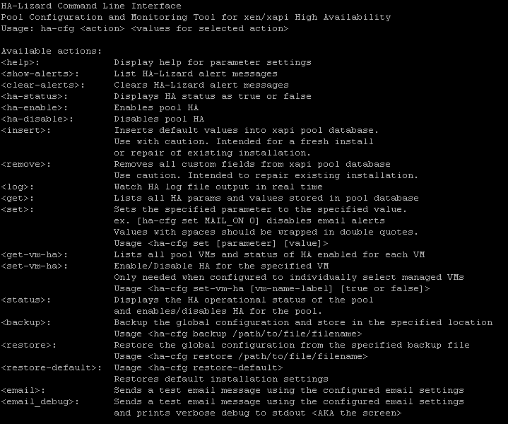{width="7.5in" height="6.25in"}

| subcommands       | Description                                                                                                        |
| ----------------- | ------------------------------------------------------------------------------------------------------------------ |
| `clear-alerts`    | Deletes all HA-Lizard active alerts.                                                                               |
| `email`           | Sends a test email alert using the configured email settings. Useful for testing email alerting functionality.     |
| `email_debug`     | Identical to `email` but produces verbose SMTP logs for troubleshooting.                                           |
| `get`             | Lists all global parameters and their values. Useful for checking current configuration and parameter syntax.      |
| `get-vm-ha`       | Lists VMs in the pool and shows if HA is enabled for each. Useful for determining HA status of VMs.                |
| `ha-disable`      | Disables pool HA.                                                                                                  |
| `ha-enable`       | Enables pool HA.                                                                                                   |
| `ha-status`       | Displays HA status as true or false.                                                                               |
| `insert`          | Initializes default parameters and writes them to the XAPI database with default values.                           |
| `log`             | Displays system logs written by HA. Useful for monitoring and troubleshooting.                                     |
| `remove`          | Erases all global parameters from the XAPI database, cleaning the database for manual removal of HA from the pool. |
| `restore`         | Restores a previously backed-up configuration file and applies it to all hosts in the pool.                        |
| `restore-default` | Restores default installation settings.                                                                            |
| `set`             | Modifies the value of a global parameter. Requires additional arguments (`<parameter> <value>`).                   |
| `set-vm-ha`       | Enables or disables HA for a specific VM. Requires VM name-label and a true/false value.                           |
| `show-alerts`     | Displays active alerts in the shell.                                                                               |
| `status`          | Displays whether HA is enabled or disabled for the pool. Allows toggling HA status.                                |
| `set`             | Modifies the value of any global parameter. The command requires the parameter name and a new value.               |

### Additional Notes

#### `insert`

The default CentOS-based installer will run this tool with the "insert" subcommands. This action should only be completed once for an entire pool. Insert will create all the required global parameters and write them to the XAPI database with default values. This tool is helpful when installing on non-CentOS-based hosts where the default installer cannot be used. Running this manually will initialize all default values. Running this over an existing installation may overwrite the global pool parameters.

#### `remove`

This subcommands will erase all global parameters from the XAPI database. This will essentially "clean" the database and should only be performed when removing HA from a pool manually. The provided uninstall script will execute this action by default.

#### `set-vm-ha`

This subcommands is used to enable or disable HA for the specified VM name-label. The passed-in name-label must exactly match the name of the VM. The value must be set to true or false.

**Important:** If the VM name-label has spaces, it must be wrapped in single or double quotes as follows:

```bash
ha-cfg set-vm-ha "VM name with spaces" true
```

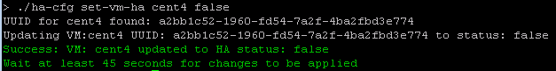{width="6.5in" height="0.84in"}

#### `get-vm-ha`

This subcommands will list all VMs within a pool and display whether HA is enabled for each VM. Additional information is provided depending on the pool setting context. This tool is useful for quickly determining the HA status of any VM.

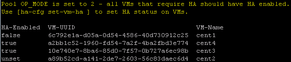{width="6.2in" height="1.32in"}

#### `email`

```bash
ha-cfg email

```

This subcommands will send a test email alert using the configured email settings. This is useful for testing the configured values to ensure that email alerting is working properly.

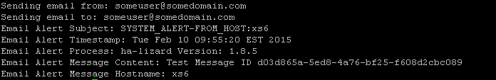{width="6.5in" height="1.06in"}

#### `email_debug`

```bash
ha-cfg email_debug
```

The `email_debug` subcommands is identical to the `email` subcommands except that it will produce verbose SMTP logs and output them to stdout. This is useful when troubleshooting SMTP problems.

### Global Configuration

Global configuration parameters are stored in the XAPI database shared by all hosts within a pool. A command-line tool, `ha-cfg`, is provided for making changes to any of the global parameters. To view the current configuration, use:

```bash
ha-cfg get
```

Sample output is shown below.

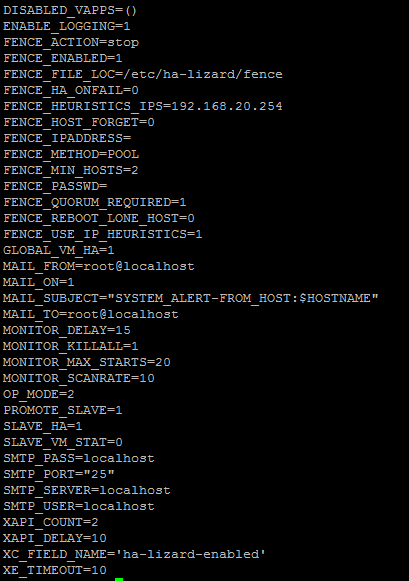{width="4.26in" height="6.05in"}

Any global configuration parameter can be updated using the `ha-cfg set` command. For example, to disable logging globally, use:

```bash
ha-cfg set enable_logging 0
```

### Override Configuration

By default, configuration settings for the entire pool are centrally stored and managed. A single set of configuration parameters is used across all hosts within a pool, regardless of whether a host is acting as the pool master or a slave. This makes management simple while eliminating the need to manage individual configuration files on each host within a pool.

In cases where a custom configuration is required for individual hosts within a pool, the system will allow for the override of any global settings. All override settings are stored in `/etc/ha-lizard/ha-lizard.conf`. By default, all settings are commented out of this file. Uncommenting a setting will override the global setting for a particular host on the next invocation of the HA logic loop.

This is useful in cases where custom settings are required for a host that should not be shared with other hosts in the pool. One example of a good use is the `SLAVE_VM_STAT` setting, which determines whether slaves within the pool will try to start any VMs that are not running. By default, this is disabled, and only the Master is configured to start VMs that should be running. The default settings work fine for a small pool, but in very large pools, it may take some time for the Master to loop through all VMs and check their status. Enabling `SLAVE_VM_STAT` on a few, but not all, slaves will speed up the process of detecting VM failures and restoring services. In this case, the override settings can be used to enable this on only selected hosts.

### Configuration Parameters

#### HA Monitor Configuration

The HA service is run by a monitoring service which runs continuously. The following Monitor settings are used to configure the behavior of the monitor. The provided installer installs and configures the Monitor with default settings that are acceptable in most cases. Once installed, the Monitor will run continuously as a service. Status can be checked with `service ha-lizard status`. As of version 1.7.7, the default parameter installed will be optimized for a 2-node pool with fast detection and switching of roles (failure detection in < 15 seconds).

Some values may need to be changed depending on the environment. Host performance (how long it takes to iterate through HA processes launched by the Monitor) and the size of the pool should be considered when setting these parameters.

The Monitor will launch several HA processes in a loop every 15 seconds (`MONITOR_DELAY`). The default setting of 15 seconds is intended for compact pools of 2 nodes. This value should be increased for larger pools. Generally, 45 seconds is adequate for pools of 3-8 hosts. It is a good idea to watch the system logs to ensure that all the HA processes have finished running within the `MONITOR_DELAY` window. By increasing `MONITOR_DELAY`, it will take longer to detect a failure. Decreasing `MONITOR_DELAY` will more quickly detect failures and recover. System performance and preferences should be considered carefully.

#### monitor_max_starts

Threshold for when to assume running processes are not responding. Sets how many failed starts to wait before killing any hung processes. Use caution with this setting. It should be set relatively high, as a pool recovery procedure will take considerably more time to execute, causing the system to trigger logic that attempts to detect hung processes. Processes will generally never hang unless XAPI becomes totally unresponsive. Logic is provided to abort attempts to connect to XAPI during a failure. In this case, local state files with pool state information from the last successful iteration will be used instead.

**Default** = 20

#### monitor_killall

If the `MAX_MONITOR_STARTS` threshold is reached, set whether to kill all HA-Lizard processes.

| Option | Description       |
| ------ | ----------------- |
| 1      | Yes **(Default)** |
| 2      | No                |

#### monitor_delay

Delay in seconds between re-spawning HA-Lizard. This should be adjusted to the environment. Large pools require more time for each run of HA-Lizard.

- **Default** = 15

#### monitor_scanrate

HA-Lizard will not re-spawn unless all current processes are completed. If there are active processes while attempting to start a new iteration, HA-Lizard will wait for the number of seconds set here before retrying. Each successive failure will increment a counter (`MONITOR_MAX_STARTS`) that may trigger `KILLALL`.

- **Default** = 10

#### xc_field_name

Field name used to enable/disable HA for the pool. This can also be set within the XenCenter management console to enable/disable HA within the pool. To make this field visible within XenCenter, create a custom pool level field with the name set here. The configuration contents will then be visible and alterable within XenCenter. See the section on configuring XenCenter for more details.

#### `op_mode`

Set the operating mode for `ha-lizard`.

| Option | Description                           |
| ------ | ------------------------------------- |
| 1      | Manage appliances                     |
| 2      | Manage virtual machines **(Default)** |

Mode 1 uses logic to manage appliances within the pool. By default, all appliances within a pool are managed by HA without requiring any additional settings. This is useful for small pools where most HA management functions can be handled from within XenCenter. Simply add VMs to appliances, and those VMs are automatically managed. Any VM that is not part of an appliance is not managed by HA. This technique greatly simplifies HA management, as each individual VM does not require any special settings. If some appliances should not be managed by HA, simply add the UUID of the appliances to be skipped in the `DISABLED_VAPPS` setting.

Managing appliances also provides a convenient way to configure startup order and delays when recovering VMs. This can be done as part of the standard appliance configuration settings.

Mode 2 provides greater flexibility by offering a mechanism for more granular control over which pool VMs are managed. Appliances are not managed in this mode. By default (when `GLOBAL_VM_HA` is set to 1), all VMs are automatically managed by HA. If `GLOBAL_VM_HA` is set to 0, then each VM within the pool must have HA explicitly enabled or disabled. This can be set from the pool GUI with access to custom configuration parameters or via the command-line tool `ha-cfg`.

#### global_vm_ha

Set whether to individually enable HA on each VM within the pool (when `OP_MODE = 2`).

| Option | Description                                                                              |
| ------ | ---------------------------------------------------------------------------------------- |
| 0      | You must individually set `ha-lizard-enabled` to true/false for each VM within the pool. |
| 1      | ALL VMs have HA enabled regardless of the setting in GUI/CLI. **(Default)**              |

#### enable_logging

Enable logging.

| Option | Description       |
| ------ | ----------------- |
| 1      | Yes **(Default)** |
| 2      | No                |

Logs are written to `/var/log/messages` or `/var/log/user.log` (depending on the `dom0` distribution). All log messages are labeled with `ha-lizard` for easy filtering. View/Filter real-time logging with: `tail -f /var/log/[messages|user.log] | grep ha-lizard`.

#### disabled_vapps

Specify UUID(s) of VAPPS that do not get automatically started by HA-Lizard when `OP_MODE=1` (manage appliances). The array is `:` delimited like this: (`UUID1:UUID2:UUID3`). Leave blank if ALL VAPPS are managed by HA-Lizard.

- Example: `DISABLED_VAPPS=()`
  **Only applied when `OP_MODE=1`.**

#### xe_timeout

Set the maximum wait time for calls to the `xe` toolstack to respond. If `xe` does not respond within `XE_TIMEOUT` seconds, the `xe` PID will be killed. This is done to prevent `xe` calls from hanging in the event of a Master host failure. In the event of a Master failure, `xe` may hang on requests from pool slaves. This timeout will ensure that fencing of the master host is not prevented. The default setting is 5 seconds, which is ample time for a well-running pool. Poor-performing hosts may need to set this value higher to prevent unintended process terminations during normal operation.

#### xapi_count

If a pool member cannot reach a pool peer, `XAPI_COUNT` is the number of retry attempts when a host failure is detected. If the unresponsive host is recovered before the `XAPI_COUNT` is reached, attempts to fence and remove the failed host will be ignored.

- **Default** = 2

#### xapi_delay

If a pool member cannot reach a pool peer, `XAPI_DELAY` is the number of seconds to wait in between `XAPI_COUNT` attempts to contact the unresponsive host.

- **Default** = 10 seconds.

#### slave_ha

If the Pool Master cannot be reached and all attempts to reach it have been exhausted, set whether the autoselected slave will try to start appliances and/or VMs. (`PROMOTE_SLAVE` must also be set to 1 for this to work).

#### promote_slave

If the pool master cannot be reached, set whether the slave should be promoted to pool master. (This only affects a single slave: the "autoselect" winner chosen by the former master to recover the pool). More on this topic is available in the Cluster Management section.

#### slave_vm_stat

By default, only the pool master will check the status of all VMs managed by this script and attempt to start a VM that is not in the running state. Setting `SLAVE_VM_STAT` to 1 will cause any pool slaves to also check all VM statuses and attempt to start any VM not in the running state.

- **Default** = 0.

In a large pool, many hosts may attempt to start the same VM. The first host to attempt will succeed, and others will be safely declined. Enabling this option may create many unnecessary duplicate processes in the pool.

#### mgt_link_loss_tolerance

Set the maximum number of seconds that the pool master can lose its management link. The timer is triggered by the management interface being down (e.g., cable pull or switch power failure). Once the timeout has been reached, the master will forcefully shut down any VMs running on the master.

- **Default value** = 5 seconds.
  This timer should be kept short to ensure that a surviving slave can exclusively start any affected VMs.

#### host_select_method

Select the method used to select a host to start a VM on.

| Option | Description                                                                                                    |
| ------ | -------------------------------------------------------------------------------------------------------------- |
| 0      | intelligent mode. A host is selected based on its health, which is tracked every few seconds.                  |
| 1      | legacy mode. A slave failure will also trigger a loss of XenCenter connectivity. **(Default and Recommended)** |

### Email Alert Settings

| Setting        | Description                                                          |
| -------------- | -------------------------------------------------------------------- |
| `mail_on`      | Enable/Disable email alerts. **1** = enabled, **0** = disabled.      |
| `mail_subject` | Subject line of the email alert.                                     |
| `mail_from`    | The "FROM" email address used for email alerts.                      |
| `mail_to`      | The email address to send alerts to.                                 |
| `smtp_server`  | Declare the SMTP server to use for sending email alerts.             |
| `smtp_port`    | Declare the port number for the SMTP server.                         |
| `smtp_user`    | If the SMTP server requires login, set the username.                 |
| `smtp_pass`    | If the SMTP server requires login with a password, set the password. |

> [!IMPORTANT]
> Do not use spaces when setting via the CLI tool. If spaces are required in the subject line, use the override configuration file instead and wrap the string in double quotes like this: `"Mail Subject"`.

### Fencing Configuration Settings

Currently Supported FENCE_METHOD = ILO, XVM, POOL, IRMC.

| FENCE_METHOD | Description                                                                                                   |
| ------------ | ------------------------------------------------------------------------------------------------------------- |
| **ILO**      | HP Integrated Lights Out management interface.                                                                |
| **XVM**      | Intended for test environments with nested Xen instances where pool dom0s are domUs within a single Xen host. |
| **POOL**     | Does not fence failed hosts. It simply allows the forceful removal of a failed host from a pool.              |
| **IRMC**     | Fujitsu BMC similar to HP ILO.                                                                                |

The name of any custom fencing agent can also be named here. See the fencing section for details on using a custom fencing script.

#### FENCE_ENABLED

| Option | Description |
| ------ | ----------- |
| 0      | Enabled     |
| 1      | Disabled    |

#### FENCE_FILE_LOC

Location to store and look for fencing scripts.

#### FENCE_HA_ONFAIL

Select whether to attempt starting the failed host's VMs on another host if fencing fails.

| Option | Description |
| ------ | ----------- |
| 0      | Enabled     |
| 1      | Disabled    |

#### FENCE_METHOD

| Option | Description                                                                                                   |
| ------ | ------------------------------------------------------------------------------------------------------------- |
| ILO    | HP Integrated Lights Out management interface.                                                                |
| XVM    | Intended for test environments with nested Xen instances where pool dom0s are domUs within a single Xen host. |
| POOL   | Does not fence failed hosts. It simply allows the forceful removal of a failed host from a pool.              |
| CUSTOM | Custom fencing scripts can be added and called here.                                                          |

#### FENCE_PASSWD

Password for the fence device (only if required by the fence device).

#### FENCE_ACTION

Supported actions: start, stop, reset.

#### FENCE_REBOOT_LONE_HOST

If the Master host cannot see any other pool members (in pools with 3 or more hosts), choose whether to reboot before attempting to fence peers. This may not matter if quorum is used (see FENCE_QUORUM_REQUIRED).

| Option | Description |
| ------ | ----------- |
| 0      | Enabled     |
| 1      | Disabled    |

- In version 1.8.9, the logic has been expanded to deal with a 2-node pool.
- In a 2-node pool, the master will self-fence (in the form of a reboot).

This releases the primary storage role from being asserted for users running iSCSI-HA in conjunction with HA-Lizard. In doing so, a surviving slave (which promotes itself to pool master) would be able to assert the primary storage role, which is required to expose disk images to VMs.

#### FENCE_IPADDRESS

Only used for static fencing devices - currently XVM host supported. Can be used for custom fencing scripts that call a static IP, such as a power strip.

#### FENCE_HOST_FORGET

**Will be Deprecated in future releases**
Only use if you know what you are doing. As of version 1.6.41, this is no longer necessary. Setting this to 0 is recommended.\*\*
Select whether to forget a fenced host (permanently remove it from the pool).

| Option | Description |
| ------ | ----------- |
| 0      | Enabled     |
| 1      | Disabled    |

#### FENCE_MIN_HOSTS

Do not allow fencing when fewer than this number of hosts are remaining in the pool.

**Default value = 2** (which is optimized for a 2-node pool.)

#### FENCE_QUORUM_REQUIRED

Select whether pool remaining hosts should have quorum before allowing fencing.

| Option | Description |
| ------ | ----------- |
| 0      | Enabled     |
| 1      | Disabled    |

#### FENCE_USE_IP_HEURISTICS

Select whether to poll additional IP endpoints (other than the pool hosts) and possibly create an additional vote used to determine quorum for the pool. This can be helpful in a 2-node pool where quorum cannot otherwise be achieved.

| Option | Description |
| ------ | ----------- |
| 0      | Enabled     |
| 1      | Disabled    |

#### FENCE_HEURISTICS_IPS

Create a list of IP addresses or domain names to check. The list should be delimited by ":".

As of version 1.7.7, the default value is set to 8.8.8.8, which is a well-known address. **However, live production systems should NOT use the default address.** This address should ideally be set to a local IP on the management network that is very close to the management interface of the hosts. Typically, this would be the IP address of the switch the hosts are connected to. If more than one IP address is specified, all of the addresses must be successfully reached with ping in order to count as a single vote.

### Additional Local Configuration Parameters {#additional-local-configuration-parameters .unnumbered}

Granular control over logging and email alerts is provided in the local configuration override file. These settings allow for enabling/disabling logging alerts and email alerts on a per-function basis. These can be useful when troubleshooting or logging a specific function or to minimize the volume of log files and system email alerts.

### Logging and Email Alert Settings

#### Logging Control (1 = Enabled, 0 = Disabled)

| Setting                            | Default Value | Description                                       |
| ---------------------------------- | ------------- | ------------------------------------------------- |
| `LOG_check_ha_enabled`             | 1             | Logs for `check_ha_enabled`                       |
| `LOG_get_pool_host_list`           | 1             | Logs for `get_pool_host_list`                     |
| `LOG_get_pool_ip_list`             | 1             | Logs for `get_pool_ip_list`                       |
| `LOG_master_ip`                    | 1             | Logs for `master_ip`                              |
| `LOG_check_xapi`                   | 1             | Logs for `check_xapi`                             |
| `LOG_get_app_vms`                  | 1             | Logs for `get_app_vms`                            |
| `LOG_vm_state`                     | 1             | Logs for `vm_state`                               |
| `LOG_vm_state_check`               | 1             | Logs for `vm_state_check`                         |
| `LOG_vm_mon`                       | 1             | Logs for `vm_mon`                                 |
| `LOG_promote_slave`                | 1             | Logs for `promote_slave`                          |
| `LOG_get_vms_on_host`              | 1             | Logs for `get_vms_on_host`                        |
| `LOG_get_vms_on_host_local`        | 1             | Logs for `get_vms_on_host_local`                  |
| `LOG_check_vm_managed`             | 1             | Logs for `check_vm_managed`                       |
| `LOG_write_pool_state`             | 0             | Logs for `write_pool_state` (disabled by default) |
| `LOG_check_slave_status`           | 1             | Logs for `check_slave_status`                     |
| `LOG_fence_host`                   | 1             | Logs for `fence_host`                             |
| `LOG_email`                        | 1             | Logs for `email`                                  |
| `LOG_autoselect_slave`             | 1             | Logs for `autoselect_slave`                       |
| `LOG_check_quorum`                 | 1             | Logs for `check_quorum`                           |
| `LOG_xe_wrapper`                   | 1             | Logs for `xe_wrapper`                             |
| `LOG_check_logger_processes`       | 1             | Logs for `check_logger_processes`                 |
| `LOG_check_xs_ha`                  | 1             | Logs for `check_xs_ha`                            |
| `LOG_disable_ha_lizard`            | 1             | Logs for `disable_ha_lizard`                      |
| `LOG_update_global_conf_params`    | 1             | Logs for `update_global_conf_params`              |
| `LOG_service_execute`              | 1             | Logs for `service_execute`                        |
| `LOG_stop_vms_on_host`             | 1             | Logs for `stop_vms_on_host`                       |
| `LOG_check_master_mgt_link_state`  | 1             | Logs for `check_master_mgt_link_state`            |
| `LOC_write_status_report`          | 1             | Logs for `write_status_report`                    |
| `LOG_validate_vm_ha_state`         | 1             | Logs for `validate_vm_ha_state`                   |
| `LOG_reset_vm_vdi`                 | 1             | Logs for `reset_vm_vdi`                           |
| `LOG_validate_this_host_vm_states` | 1             | Logs for `validate_this_host_vm_states`           |

#### Email Alert Control (1 = Enabled, 0 = Disabled)

| Setting                             | Default Value | Description                                     |
| ----------------------------------- | ------------- | ----------------------------------------------- |
| `MAIL_get_pool_host_list`           | 1             | Email alerts for `get_pool_host_list`           |
| `MAIL_get_pool_ip_list`             | 1             | Email alerts for `get_pool_ip_list`             |
| `MAIL_master_ip`                    | 1             | Email alerts for `master_ip`                    |
| `MAIL_check_xapi`                   | 1             | Email alerts for `check_xapi`                   |
| `MAIL_get_app_vms`                  | 1             | Email alerts for `get_app_vms`                  |
| `MAIL_vm_state`                     | 1             | Email alerts for `vm_state`                     |
| `MAIL_vm_state_check`               | 1             | Email alerts for `vm_state_check`               |
| `MAIL_vm_mon`                       | 1             | Email alerts for `vm_mon`                       |
| `MAIL_promote_slave`                | 1             | Email alerts for `promote_slave`                |
| `MAIL_get_vms_on_host`              | 1             | Email alerts for `get_vms_on_host`              |
| `MAIL_get_vms_on_host_local`        | 1             | Email alerts for `get_vms_on_host_local`        |
| `MAIL_check_vm_managed`             | 1             | Email alerts for `check_vm_managed`             |
| `MAIL_write_pool_state`             | 1             | Email alerts for `write_pool_state`             |
| `MAIL_check_slave_status`           | 1             | Email alerts for `check_slave_status`           |
| `MAIL_fence_host`                   | 1             | Email alerts for `fence_host`                   |
| `MAIL_email`                        | 1             | Email alerts for `email`                        |
| `MAIL_autoselect_slave`             | 1             | Email alerts for `autoselect_slave`             |
| `MAIL_check_quorum`                 | 1             | Email alerts for `check_quorum`                 |
| `MAIL_xe_wrapper`                   | 1             | Email alerts for `xe_wrapper`                   |
| `MAIL_check_xs_ha`                  | 1             | Email alerts for `check_xs_ha`                  |
| `MAIL_update_global_conf_params`    | 1             | Email alerts for `update_global_conf_params`    |
| `MAIL_service_execute`              | 1             | Email alerts for `service_execute`              |
| `MAIL_stop_vms_on_host`             | 1             | Email alerts for `stop_vms_on_host`             |
| `MAIL_check_master_mgt_link_state`  | 1             | Email alerts for `check_master_mgt_link_state`  |
| `MAIL_write_status_report`          | 1             | Email alerts for `write_status_report`          |
| `MAIL_validate_vm_ha_state`         | 1             | Email alerts for `validate_vm_ha_state`         |
| `MAIL_reset_vm_vdi`                 | 1             | Email alerts for `reset_vm_vdi`                 |
| `MAIL_validate_this_host_vm_states` | 1             | Email alerts for `validate_this_host_vm_states` |

### Configuring Email Alerts

HA-Lizard can be configured to send email alerts for a variety of events that an administrator should generally be aware of. As of version 1.8, the method for configuring email has changed. Prior to version 1.8.x, HA-Lizard relied on sendmail running locally to act as an SMTP relay for sending messages. The need to install and run sendmail locally has been removed in version 1.8.x in an effort to remove ALL dependencies from HA-Lizard.

Version 1.8.x will continue to be backward compatible with earlier versions and can use a local SMTP relay (sendmail) if configured to do so.

#### Configuring a Local SMTP Server

Email alerts require that an SMTP server is specified for sending email.

The default setting for the SMTP server on a new installation is **"127.0.0.1"**. For users running sendmail locally, this will automatically route all messages through sendmail. The following settings will work with a locally running SMTP relay that does not require user login:

```bash
MAIL_FROM=your_FROM_address@your_company.com
MAIL_ON=1
MAIL_SUBJECT="SYSTEM_ALERT-FROM_HOST:$HOSTNAME"
MAIL_TO=your_TO_address@your_company.com
SMTP_PASS=
SMTP_PORT="25"
SMTP_SERVER="127.0.0.1"
SMTP_USER=
```

#### Configuring an SMTP Server with Authentication

The preferred method of configuring email alerts is to use an outside
SMTP server rather than run an SMTP relay on the control domain. The
configuration settings will support any standard SMTP server with or
without login. The following settings will work with a remote SMTP
server. **_Adapt to match your environment. These settings are a sample
only._**

```bash
MAIL_FROM=your_FROM_address@your_company.com
MAIL_ON=1
MAIL_SUBJECT="SYSTEM_ALERT-FROM_HOST:$HOSTNAME"
MAIL_TO=your_TO_address@your_company.com
SMTP_PASS=smtp_password
SMTP_PORT="25"
SMTP_SERVER=smtp.your_smtp_domain_here.com
SMTP_USER=smtp_username
```

#### Troubleshooting Email Alerting

##### email

The HA-Lizard CLI provides tools for testing and validating email settings. Once the desired configuration settings have been applied, a test email can be sent from the CLI as follows:

```bash
ha-cfg email
```

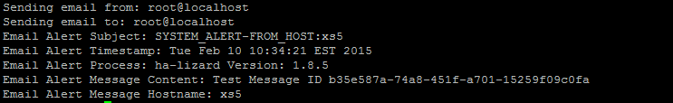{width="6.5in" height="1in"}

If the email and SMTP server settings are correctly configured, an email alert should be received by the user set in the `mail_to` field.

##### email_debug

Alternatively, the CLI can be used to send a test email while producing verbose debug. This can be very useful to troubleshoot the interaction between the host and the SMTP server. A test email with debug can be
sent using the CLI as follows:

```bash
ha-cfg email_debug
```

An error message such as the one below may be seen when a socket connection could not be made to the configured SMTP server:

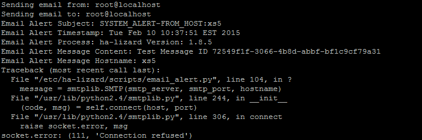{width="6.5in" height="2.17in"}

A successful email alert will produce debug similar to the below example:

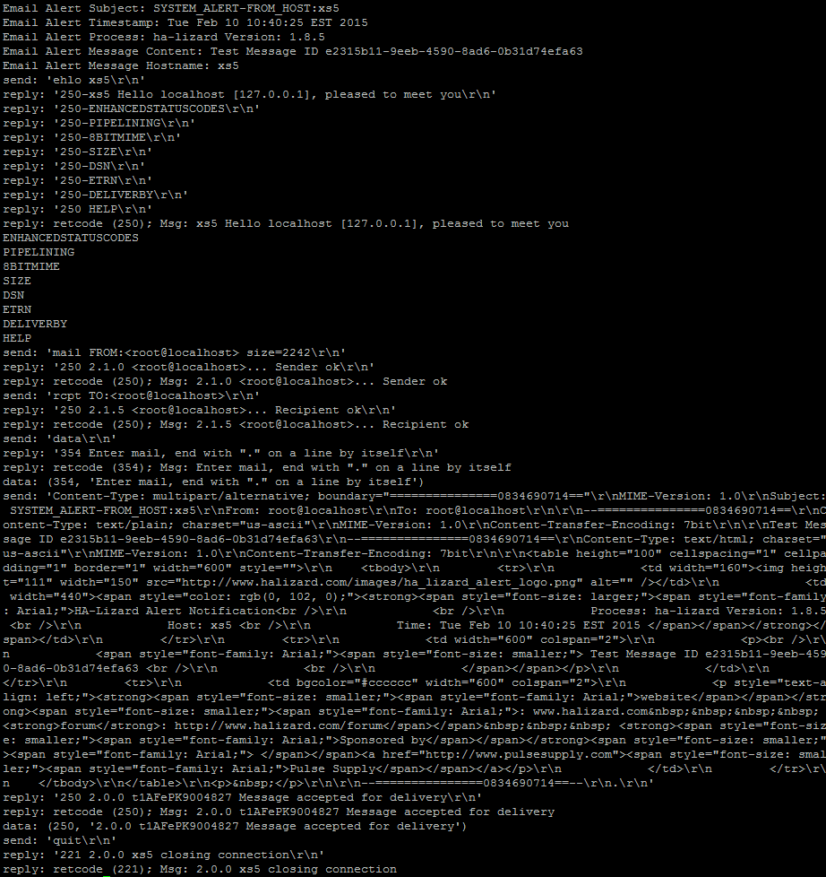{width="6.5in" height="6.9in"}

### Modes of Operation

Two modes of operation are supported by HA-Lizard.

#### Mode 1

Uses logic to manage appliances within the pool. By default, all appliances within a pool are managed by HA without requiring any additional settings. This is useful for small pools where most HA management functions can be handled from within a compatible graphical configuration utility. Simply add VMs to appliances and those VMs are automatically managed. Any VM that is not part of an appliance is not
managed by HA. This technique greatly simplifies HA management as each individual VM does not require any special settings. If some appliances should not be managed by HA, simply add the UUID of the appliances to be skipped in the `DISABLED_VAPPS` setting.

#### Mode 2

Provides greater flexibility by providing a mechanism for more granular control over which pool VMs are managed. Appliances are not managed in this mode. By default (when `GLOBAL_VM_HA` is set to 1), all VMs are automatically managed by HA. If `GLOBAL_VM_HA` is set to 0, then each VM within the pool must have HA explicitly enabled or disabled. This can be set from the pool GUI with access to custom configuration
parameters or via the command line tool `ha-cfg`.

#### Mode Configuration

The operating mode can be configured as a global setting or override setting, which allows hosts within a pool to operate in a mixed environment with some hosts managing VMs while others manage appliances.
Usually, the default global setting which manages VMs is adequate.

The default global settings manage all VMs within a pool and attempts to move VMs from failed hosts or start them if not running. This approach works well in most instances. If more granularity is required to select which VMs are managed, only certain VMs as managed and others ignored, a configuration setting is provided which can be set per VM. Settings can be applied using the `ha-cfg` command line tool or via a compatible graphical management interface with visibility into custom XAPI fields.

### Managing HA Services

#### HA-Lizard System Service

When installing on a CentOS-based Dom0, the installer will install a startup script in `/etc/init.d` and set it to automatically start each time the server is started. Generally, there are no additional steps
required in setting up the system service.

The service can be checked, stopped, or invoked with the `service` command, which manages System V init scripts. The following arguments are supported:

```bash
service ha-lizard start # Starts the service
service ha-lizard stop # Stops the service
service ha-lizard status # Reports running status of the service
```

By default, a watchdog service is installed and started when installing with the included installer.

> **Important Note:** Stopping the HA service while the watchdog service is running will be ineffective as the watchdog will restart the HA service within a few seconds after a stop. In previous versions of HA-Lizard, the HA-Lizard init script can be invoked with a `-w` option to also start or stop the watchdog service with the HA service. The `--w` option has been removed as of version 2.1 due to the inability to pass additional arguments under systemd.

### Starting HA-Lizard {#starting-ha-lizard .unnumbered}

```bash
service ha-lizard start # Starts the service and the watchdog
service ha-lizard stop # Stops the service (watchdog will continue to run)
service ha-lizard status # Reports running status of the service
```

### HA Watchdog Service {#ha-watchdog-service .unnumbered}

A watchdog service is installed by default and started/stopped via the
main service init script or can be individually managed with:

```bash
service ha-lizard-watchdog start # Starts the service
service ha-lizard-watchdog stop # Stops the service
service ha-lizard-watchdog status # Reports running status of the service
```

The default watchdog interval for checking the HA service is 10 seconds.
This can be changed by editing the variable `WATCH_INTERVAL` in `/etc/init.d/ha-lizard-watchdog`.

### Disabling the Watchdog Service {#disabling-the-watchdog-service .unnumbered}

The watchdog service is mandatory when fencing is enabled. If fencing is not enabled, the watchdog service can be disabled by commenting or deleting the line `WATCHDOG=/etc/init.d/ha-lizard-watchdog` in the HA
init script located in `/etc/init.d/ha-lizard`.

#### HA Monitor

A monitor daemon is provided for manually running the HA service. This is intended only for systems that are not compatible with the provided init script as described above.

> [!IMPORTANT]
> Avoid running this script if the system service is already installed, as it could result in multiple monitors running, which will impact performance.

The monitor is required to be running at all times for HA to work. It can be started in any of the following manners:

- Manually start the monitor and background it:

```bash
/etc/ha-lizard/scripts/ha-lizard.mon &
```

- If your host runs a Dom0 operating system other than the default **CentOS**, an init script can be created that calls

```bash
/etc/ha-lizard/scripts/ha-lizard.mon
```

- Add a line to `/etc/rc.local` which calls the monitor script on boot:

```bash
/etc/ha-lizard/scripts/ha-lizard.mon &
```

## Managing HA for the Pool

To enable HA mode for the pool, each host must be running the monitor service as previously described. The monitor periodically calls the main HA-Lizard logic to execute the pool's HA functions. Several configurable timers and triggers, located in the configuration settings, determine how often the monitor invokes the HA script and when to abort. Regardless of the chosen method for running the monitor, HA must be enabled to operate in HA mode.

> [!NOTE]
> Enabling HA is not the same as starting the monitor.

There are three methods for enabling or disabling HA for the pool:

- Enable/Disable HA via XenCenter or any compatible GUI capable of modifying a custom configuration field.
- Using the CLI tool:

```bash
ha-cfg status
```

- Using the CLI tool:

```bash
ha-cfg ha-enable
```

Regardless of HA's state, the monitor service will run in the background on each host within the pool. The monitor will periodically check if HA is enabled and decide whether to provide pool-level HA based on the pool's operational status.

## Cluster Management and Fencing

Cluster management and fencing using STONITH are included with the HA-Lizard package. Configuration of these features is handled via global or override settings.

### Pool Cluster Management

The system does not require an external cluster manager, which would otherwise add complexity to the pool and hosts. The software design avoids additional packages or services that could introduce instability. Therefore, built-in cluster management is provided, designed to be lightweight and extensible.

#### Cluster Failover and Recovery Logic

Node failover and recovery are based on the pool concept of "Master and Slaves". A pool can only have one Master node and any number of Slave nodes. Cluster management is designed with this structure.

- Slaves cannot detect failures of other slaves or remove them from the pool.
- Only the Master host can detect a Slave host failure and take steps to fence and remove the Slave.
- Only one Slave can detect a Master host failure. This Slave can eject the failed Master and promote itself to become the new Pool Master. This prevents multiple Slaves from trying to become the Pool Master simultaneously.
- The single Slave eligible to eject the failed Master and become the new Pool Master is dynamically chosen by the Pool Master during each HA iteration (approximately every minute). The chosen Slave's UUID is stored in the XAPI database. Slaves will check this value on each HA iteration to determine their status. If XAPI is unresponsive during a Master failure, the last successfully stored "autopromote winner" will be used.
- The system dynamically determines the roles of the hosts in the cluster. Each HA iteration detects whether a host is the Master or Slave and applies logic accordingly. Every iteration also selects a new "autopromote winner". If a Master fails and a Slave takes over, the new Master will select a new Slave to be eligible for promotion.

#### Split Brain Handling

IP heuristics provide an additional quorum vote to determine if the remaining hosts in a pool have quorum to take over services and remove failed hosts. This is particularly useful in a 2-node pool, where quorum cannot normally be achieved, preventing HA recovery actions. While any number of IP addresses can be used, the selection of useful addresses should be considered carefully. A large number of addresses may slow down recovery procedures. Ideal addresses include the IP address of shared storage or a network switch common to all hosts in the pool. To count as a single vote, all IP addresses must be reachable via ICMP ping. In a two-node pool, this additional vote allows the surviving node to take over services of the failed node.

#### HA Suspension

To prevent split-brain scenarios, Slaves that fail to fence a Master or lack quorum will enter a suspended HA mode and reboot once. After the reboot, the host's HA logic will be suspended until:

- An administrator manually resolves the pool failure and removes the suspension by running the script: `/etc/ha-lizard/scripts/recover_fenced_host`
- The affected host automatically removes the suspension once its health status returns to "healthy"

After the reboot, the host will remain in the suspended state, blocking any HA logic such as:

- Fencing the Master
- Starting VMs

HA suspension only affects the self-fenced host. The other hosts in the pool remain unaffected.

#### Checking if a Host is Suspended {#checking-if-a-host-is-suspended .unnumbered}

The system will send an email alert when a host enters suspended HA mode. By default, alerts are triggered every hour until the issue is resolved and the suspension cleared. The CLI tool can be used to check the host's status using the `ha-cfg status` command.

A suspended host will display the following notice:

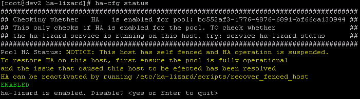{width="6.5in" height="1.8in"}

#### Restoring Suspended HA

A suspended host should only be restored once the pool is fully operational. To remove the suspension, execute `/etc/ha-lizard/scripts/recover_fenced_host` from the affected host's local command shell. A warning message will appear-pressing `<enter>` will remove the suspension.

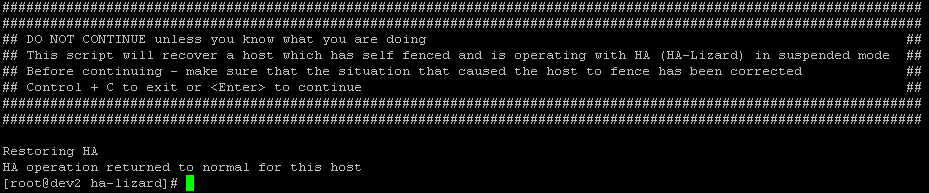{width="6.5in" height="1.4in"}

#### Fencing and STONITH

The HA-Lizard package supports three fencing options: POOL, ILO, and XVM. A structured interface allows for easy implementation of custom fencing scripts.

#### ILO Fencing

ILO fencing is included as part of HA and was developed and tested on ILO 2. The fencing logic powers off a host and verifies the power state is off before removing the host from the pool configuration.

The following configuration parameters provide basic ILO fencing:

```bash
FENCE_ENABLED=1
FENCE_ACTION=stop
FENCE_FILE_LOC=/etc/ha-lizard/fence
FENCE_HA_ONFAIL=0
FENCE_HOST_FORGET=0
FENCE_METHOD=ILO
FENCE_MIN_HOSTS=3
FENCE_PASSWD=<ILO Password> Should be consistent across all hosts in pool or use override
FENCE_REBOOT_LONE_HOST=0
FENCE_QUORUM_REQUIRED=1
```

The ILO.hosts file must be populated with UUID:IP pairs for each host in the pool. The file should not contain spaces. Each line lists `<UUID of Host>:<ILO IP Address>` separated by a colon. This file should be located in `/etc/ha-lizard/fence/ILO` and named `ILO.hosts`. Ensure correct capitalization and spelling, as the file names are dynamically built using the HA configuration parameters.

To edit or create the file, run the following from the command line:

```bash
vi /etc/ha-lizard/fence/ILO/ILO.hosts
```

Sample file:

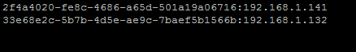{width="4.56in" height="0.68in"}

#### Pool Fencing

Pool fencing is a "dummy" fence method that does not provide STONITH (as in ILO). It forces removal of unresponsive hosts from the pool without attempting to power off the host.

The following configuration parameters provide basic Pool fencing:

```bash
FENCE_ACTION=stop
FENCE_ENABLED=1
FENCE_FILE_LOC=/etc/ha-lizard/fence
FENCE_HA_ONFAIL=1
FENCE_HOST_FORGET=0
FENCE_IPADDRESS= (IP is not necessary for POOL fence method, leave blank)
FENCE_METHOD=POOL
FENCE_MIN_HOSTS=3
FENCE_PASSWD= (Password is not necessary for POOL fence method, leave blank)
FENCE_REBOOT_LONE_HOST=0
FENCE_QUORUM_REQUIRED=1
```

#### XVM Fencing

XVM fencing is designed for test and development environments, where multiple virtual machines (VMs) simulate a large pool within a single physical host. XVM fencing will fence pool hosts that are virtual machines running on a single Dom0, each of which is running XCP or XenServer as part of a pool.

The following configuration parameters provide basic XVM fencing:

```bash
FENCE_ACTION=stop
FENCE_ENABLED=1
FENCE_FILE_LOC=/etc/ha-lizard/fence
FENCE_HA_ONFAIL=1
FENCE_HOST_FORGET=0
FENCE_IPADDRESS=<IP Address of DomO>
FENCE_METHOD=XVM
FENCE_MIN_HOSTS=3
FENCE_PASSWD=<root SSH password of DomO>
FENCE_REBOOT_LONE_HOST=0
FENCE_QUORUM_REQUIRED=1
```

The XVM.hosts file must be populated with UUID:UUID pairs for each host in the pool. The file should not contain spaces. Each line lists `<UUID of Pool Host>:<UUID of VM in Dom0>`, separated by a colon. This file should be placed in `/etc/ha-lizard/fence/XVM` and named `XVM.hosts`. Ensure correct capitalization and spelling as the file names are dynamically built using the HA configuration parameters.

To edit or create the file, run the following from the command line:

```bash
vi /etc/ha-lizard/fence/XVM/XVM.hosts
```

Sample file:

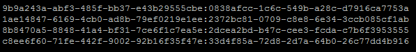{width="6.22in" height="0.79in"}

#### iRMC Fencing

iRMC fencing is included as part of HA-Lizard. The fencing logic powers off or resets a host and verifies that the power state is off before removing the host from the pool configuration.

The following configuration parameters provide basic iRMC fencing:

```bash
FENCE_ENABLED=1
FENCE_ACTION=stop
FENCE_FILE_LOC=/etc/ha-lizard/fence
FENCE_HA_ONFAIL=0
FENCE_HOST_FORGET=0
FENCE_METHOD=IRMC
FENCE_MIN_HOSTS=2
FENCE_PASSWD=<iRMC Password> Should be consistent across all hosts in pool or use override
FENCE_REBOOT_LONE_HOST=0
FENCE_QUORUM_REQUIRED=1
```

Additionally, the `IRMC.hosts` file must be populated with UUID:IP pairs for each host in the pool. This file must not contain any spaces. Each line in the file will list `<UUID of Host>:<iRMC IP Address>` delimited by a colon. The file should be placed in `/etc/ha-lizard/fence/IRMC` and named `IRMC.hosts`. Capitalization and spelling are important, as the file names are dynamically built using the HA configuration parameters.

To edit/create the file, type the following from the command line:

```bash
vi /etc/ha-lizard/fence/IRMC/IRMC.hosts
```

A sample file is presented below:

{width="4.5625in" height="0.6770833333333334in"}

#### Adding Your Own Custom Fencing Script {#adding-your-own-custom-fencing-script .unnumbered}

A structured framework is provided for adding custom fencing scripts. The general parameters for adding a custom script are as follows:

1. Choose a name for the custom fencing script. This name will be placed into the pool HA configuration and used to dynamically build file names and references. For example, for a custom fencing agent named "POWEROFF", set the fencing method configuration parameter as follows:

   ```bash
   FENCE_METHOD=POWEROFF
   ```

   This can be set with the command line configuration tool:

   ```bash
   ha-cfg set FENCE_METHOD POWEROFF
   ```

2. Create a folder with the same _exact_ name in `/etc/ha-lizard/fence/`

   ```bash
   mkdir /etc/ha-lizard/fence/POWEROFF
   ```

3. Place your custom fencing agent in the newly created folder. The agent MUST be named `POWEROFF.sh`. If your agent is not a bash script and is named something else, like `POWEROFF.py`, then simply create a wrapper named `POWEROFF.sh`. Your script must accept the following passed-in arguments:

   | Argument | Value  | Description                                                                                                                                                                                                  |
   | -------- | ------ | ------------------------------------------------------------------------------------------------------------------------------------------------------------------------------------------------------------ |
   | arg1     | UUID   | The UUID of the host to be fenced. Your script should employ some logic to convert this UUID to some useful data, like the IP address of the host or the location of a power outlet for the given host UUID. |
   | arg2     | Action | Supported actions (configured in the global configuration) are: `start`, `stop`, `reset`.                                                                                                                    |

4. Your script must return an exit status after executing.

   - Return "0" on success for the passed-in action.
   - Return "1" on general failure for the passed-in action.

### Managing via XenCenter

Once installed, the HA service can be toggled on or off via the command line tool `ha-cfg`, or via Citrix's XenCenter for users that prefer to use a graphical tool.

XenCenter custom fields can be added for:

- Enabling/Disabling HA for the entire pool.
- Enabling/Disabling HA for specific VMs within the pool (used when `GLOBAL_VM_HA` is set to 0).
- Monitoring health status of pool slaves.

The XenCenter-friendly custom fields were introduced into the pool database during the installation of HA-Lizard. Follow these steps to make these fields visible from within XenCenter:

1. Highlight the pool name in the left navigation window of XenCenter and select the General tab:

   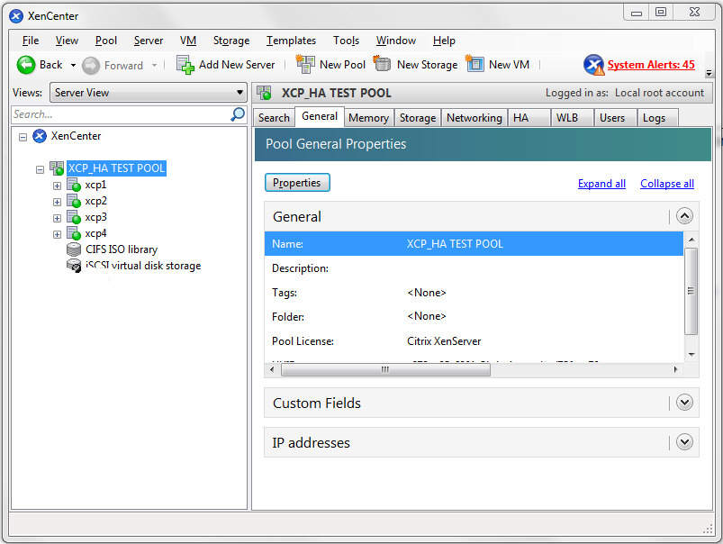{width="6.498611111111111in" height="4.888194444444444in"}

2. Select `Properties -> Custom Fields -> Edit Custom Fields -> Add`. Add a new custom field with the **_exact_** name as the pool configuration setting `XC_FIELD_NAME`. By default, this name is `ha-lizard-enabled`, and create a new field with the type set to "text":

   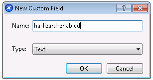{width="3.1979166666666665in" height="1.6875in"}

3. Any settings that were previously set via the command line tool should now be visible within the new XenCenter custom field. The custom field will be automatically present at both the Pool level and individual VMs and can be used in the following manner:

   - To enable or disable HA for the **entire POOL**, modify the value of the custom field at the Pool level as follows:

   | Value | Description             |
   | ----- | ----------------------- |
   | true  | Enable HA for the Pool  |
   | false | Disable HA for the Poll |

   Be aware that the entry is not validated when entered via XenCenter. The CLI tool can be used to validate the setting with `ha-cfg status`. Additionally, changing the status via the CLI will also change the status viewed within XenCenter. The CLI tool does validate entries to avoid misspelling "true" or "false" and is the preferred method to enable/disable HA.

   - To enable or disable HA for a **specific VM,** modify the value of the custom field for the VM as follows:

   | Value | Description           |
   | ----- | --------------------- |
   | true  | Enable HA for the VM  |
   | false | Disable HA for the VM |

   Be aware that the entry is not validated when entered via XenCenter. The CLI tool can be used to validate the setting with `ha-cfg get-vm-ha`. Additionally, changing the status via the CLI will also change the status viewed within XenCenter. The CLI tool does validate entries to avoid misspelling "true" or "false" and is the preferred method to enable/disable HA for VMs. Use the CLI command `ha-cfg set-vm-ha` to enable/disable HA from the command line.

> [!WARNING]
> Deleting the custom field from XenCenter will delete the HA settings for the pool. _Do not delete the custom field once created._

### Manage HA from XenCenter

With a custom field set within XenCenter, an administrator can check or edit HA status for the pool or individual VMs, depending on context, as follows:

When viewing the HA status at the Pool level, the custom field will display `true/false`. This is a pool-wide setting that controls HA for all hosts within the pool:

| Value | Description                                                                                          |
| ----- | ---------------------------------------------------------------------------------------------------- |
| true  | HA is enabled for the Pool                                                                           |
| false | HA is disabled HA for the Poll                                                                       |
| other | Anything other will trigger an **email alert** and HA will **not be active** with an invalid setting |

- When viewing the HA status at the Host level, the custom field should be empty. HA status is not currently used at the host level.

- When viewing the HA status at the VM level, the custom field will display `true/false`. This setting enables/disables HA for a specific VM and only applies when HA is configured in `OP_MODE 2` with `GLOBAL_VM_HA` set to 0, meaning HA is enabled/disabled for individual hosts (the default HA-Lizard settings globally apply HA):

  | Value | Description                                                                                                   |
  | ----- | ------------------------------------------------------------------------------------------------------------- |
  | true  | HA is enabled for the VM and will be managed/auto-started if down or during a host failure.                   |
  | false | HA is disabled for the VM and will not be managed/auto-started.                                               |
  | other | Anything other than true/false will trigger an **email alert**. HA will not be active with an invalid setting |

> [!IMPORTANT]
> At this time, settings entered via XenCenter are not validated. It is important that care is used when making changes to ensure that only valid entries are used: `true/false`. When setting HA status from the CLI tool, all entries are validated, which prevents the possibility of entering an invalid state.

### Viewing HA Status from CLI

The CLI tool can also be used to validate status as follows:

#### Pool-level

HA status can be checked with:

```bash
ha-cfg status
```

An invalid entry for Pool HA status would display the following warning:

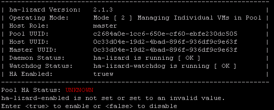{width="5.697916666666667in" height="2.28125in"}

The following will be displayed when HA is properly set:

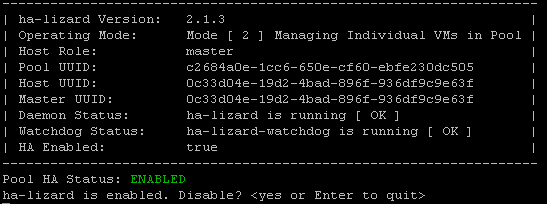{width="5.697916666666667in" height="2.125in"}

#### VM-level

HA status can be checked with:

```bash
ha-cfg get-vm-ha
```

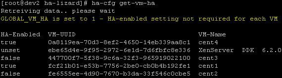{width="5.9375in" height="1.65625in"}

### Viewing HA Status from XenCenter

The custom field (`ha-lizard-enabled`) will be displayed from within XenCenter when viewing the pool with the "Search" tab selected. The following sample output details the meaning of the HA setting at the various pool contexts (pool, host, VM):

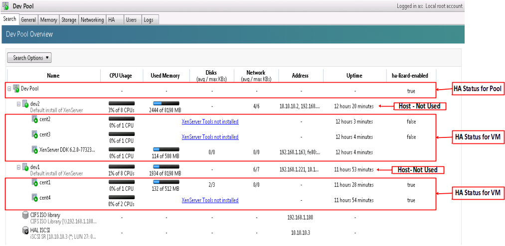

## Application and Settings Examples

### Auto-Start VMs -- WITHOUT Host High Availability

The following configuration settings can be used for a basic setup where VMs are automatically started in the following scenarios:

1. A VM has failed during normal operation
2. A host was rebooted and VMs on the host require a restart

In this mode, HA is disabled, and any host failures are ignored. In the event of a host failure, some VMs may fail to start properly while the host is still part of the pool.

```bash
DISABLED_VAPPS=()
ENABLE_LOGGING=1
FENCE_ACTION=stop
FENCE_ENABLED=0
FENCE_FILE_LOC=/etc/ha-lizard/fence
FENCE_HA_ONFAIL=0
FENCE_HEURISTICS_IPS=
FENCE_HOST_FORGET=0
FENCE_IPADDRESS=
FENCE_METHOD=POOL
FENCE_MIN_HOSTS=3
FENCE_PASSWD=
FENCE_QUORUM_REQUIRED=0
FENCE_REBOOT_LONE_HOST=0
FENCE_USE_IP_HEURISTICS=0
GLOBAL_VM_HA=1
MAIL_FROM=<enter email address>
MAIL_ON=1
MAIL_SUBJECT="SYSTEM_ALERT-FROM_HOST:$HOSTNAME"
MAIL_TO=<enter email address>
MONITOR_DELAY=45
MONITOR_KILLALL=1
MONITOR_MAX_STARTS=40
MONITOR_SCANRATE=10
OP_MODE=2
PROMOTE_SLAVE=0
SLAVE_HA=0
SLAVE_VM_STAT=1
XAPI_COUNT=5
XAPI_DELAY=15
XC_FIELD_NAME='ha-lizard-enabled'
XE_TIMEOUT=10
```

### Auto-Start VMs -- WITH Host High Availability

The following configuration settings can be used for a basic HA setup where VMs are automatically started in any of the following scenarios:

1. A VM has failed during normal operation
2. A host was rebooted and VMs on the host require a restart
3. A host (master or slave) has failed and had VMs running before the failure

Additionally, any host failure will be detected by HA, with steps taken to automatically recover and reconfigure the pool, starting any affected services.

In this mode, HA is enabled with POOL fencing, meaning that any failed host will be detected and forcibly removed from the pool. Additional configuration possibilities are available using ILO or custom fencing agents.

```bash
DISABLED_VAPPS=()
ENABLE_LOGGING=1
FENCE_ACTION=stop
FENCE_ENABLED=1
FENCE_FILE_LOC=/etc/ha-lizard/fence
FENCE_HA_ONFAIL=1
FENCE_HEURISTICS_IPS=<enter IP addresses delimited by :>
FENCE_HOST_FORGET=0
FENCE_IPADDRESS=
FENCE_METHOD=POOL
FENCE_MIN_HOSTS=3
FENCE_PASSWD=
FENCE_QUORUM_REQUIRED=1
FENCE_REBOOT_LONE_HOST=1
FENCE_USE_IP_HEURISTICS=1
GLOBAL_VM_HA=1
MAIL_FROM=<enter email address>
MAIL_ON=1
MAIL_SUBJECT="SYSTEM_ALERT-FROM_HOST:$HOSTNAME"
MAIL_TO=<enter email address>
MONITOR_DELAY=45
MONITOR_KILLALL=1
MONITOR_MAX_STARTS=40
MONITOR_SCANRATE=10
OP_MODE=2
PROMOTE_SLAVE=1
SLAVE_HA=1
SLAVE_VM_STAT=1
XAPI_COUNT=5
XAPI_DELAY=15
XC_FIELD_NAME='ha-lizard-enabled'
XE_TIMEOUT=10
```

### 2-Node Pool -- With Host High Availability

A 2-node pool is a special case where IP heuristics are required to create an additional vote to achieve quorum. This technique tries to reach IP addresses outside of the pool should a peer host be unreachable. The following settings provide full HA features in a 2-node environment. For faster switching of roles and HA recovery, consider shortening XAPI_COUNT and XAPI_DELAY.

```bash
DISABLED_VAPPS=()
ENABLE_LOGGING=1
FENCE_ACTION=stop
FENCE_ENABLED=1
FENCE_FILE_LOC=/etc/ha-lizard/fence
FENCE_HA_ONFAIL=1
FENCE_HEURISTICS_IPS=<enter IP addresses delimited by :>
FENCE_HOST_FORGET=0
FENCE_IPADDRESS=
FENCE_METHOD=POOL
FENCE_MIN_HOSTS=2
FENCE_PASSWD=
FENCE_QUORUM_REQUIRED=1
FENCE_REBOOT_LONE_HOST=0
FENCE_USE_IP_HEURISTICS=1
GLOBAL_VM_HA=1
MAIL_FROM=<enter email address>
MAIL_ON=1
MAIL_SUBJECT="SYSTEM_ALERT-FROM_HOST:$HOSTNAME"
MAIL_TO=<enter email address>
MONITOR_DELAY=45
MONITOR_KILLALL=1
MONITOR_MAX_STARTS=40
MONITOR_SCANRATE=10
OP_MODE=2
PROMOTE_SLAVE=1
SLAVE_HA=1
SLAVE_VM_STAT=1
XAPI_COUNT=5
XAPI_DELAY=15
XC_FIELD_NAME='ha-lizard-enabled'
XE_TIMEOUT=10
```

## Miscellaneous

### Dependencies and Compatibility

When installing HA onto a default CentOS-based Dom0 (XCP or XenServer), all the required tools needed to run HA are already present on the system. HA-Lizard has been specifically designed to require **_zero dependencies_**, fulfilling the mission of creating a very light-weight application that is easy to configure with a single set of documentation for users to follow.

**_Package is compatible with XCP version 1.6, XenServer version 6.x, XenServer 7.x and XCP-ng 7.x. Prior releases may work but have not been tested._**

For custom Dom0 installations, ensure the following tools are available:

```bash
- xapi and xe toolstack
- /bin/awk
- /bin/echo
- /bin/logger
- /bin/hostname
- /opt/xensource/sm/resetvdis.py
- /bin/cat
- /bin/grep
- /usr/bin/column
- /etc/init.d/functions
```

### Security and Ports

- HTTP port 80 is used to check the running status of XAPI on hosts within the pool. Ensure that all hosts within the pool have access to port 80 on all peer hosts.
- ICMP (ping) is used to check the running status of peer hosts. Ensure that all hosts within the pool have access to ICMP on all peer hosts.

### Things to Know

- **FENCE_HOST_FORGET** will be deprecated. Avoid setting this to 1 unless you know what you are doing. This will not impact recovery of a pool, but enabling it will forcefully remove a host from the pool if the host is fenced. The host would then have to be manually repaired and reintroduced into the pool. Version 1.6.41 introduced new friendlier logic which no longer requires the forceful removal of a host.\_
- Putting the Master into maintenance mode while HA is enabled is no longer supported. It is advised that HA should be disabled before putting any hosts into maintenance mode.
- HA should be disabled for a pool before shutting down a host. Do not shut down a host without disabling HA or the host can be forcefully removed from the pool.
- Disabling ha-lizard: This can be accomplished with a custom-field accessible via a graphical management utility or the local CLI tool, ha-cfg. **IMPORTANT**: Slaves read ha-lizard-enabled from local state files and may take up to a minute before the cache is updated.

### Planned Future Improvements

- Check the complete list on the [GitHub Issues](https://github.com/ha-lizard/ha-lizard/issues)
- Possibly combine project with iSCSI-HA
- Addition of a VM start order/weighting system
- Move serialized tasks to scheduler so that recovery operations can be parallelized

### Support

- Post a question or issue on the [support forum](https://github.com/ha-lizard/ha-lizard/issues)

- Contact the project sponsor:
  - [http://www.pulsesupply.com](http://www.pulsesupply.com/)
  - <ha@pulsesupply.com>
